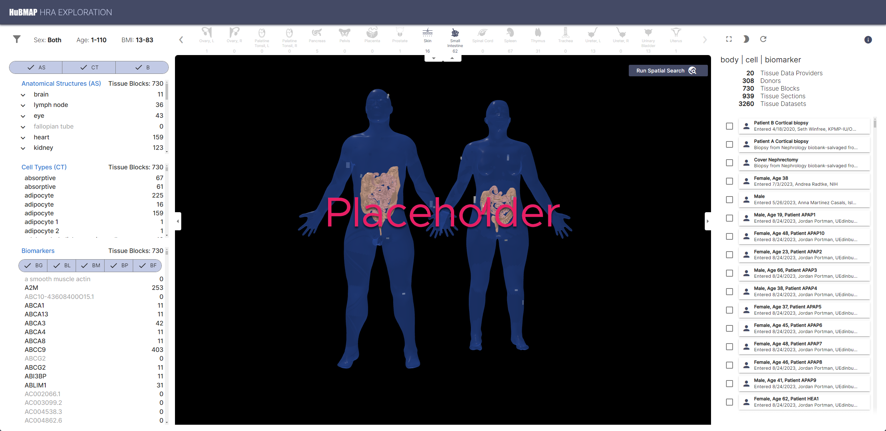
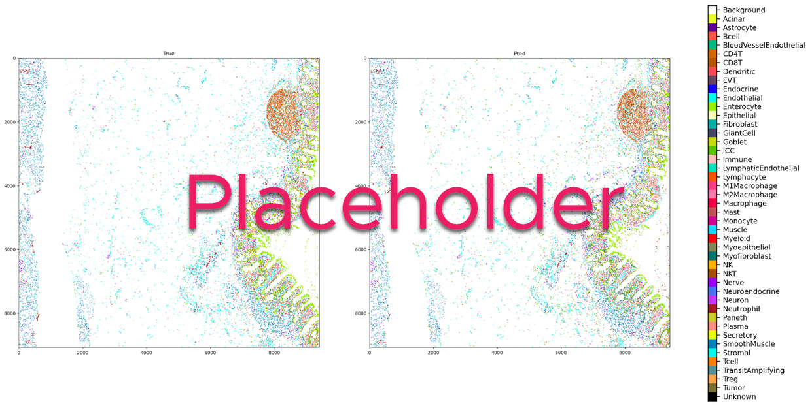
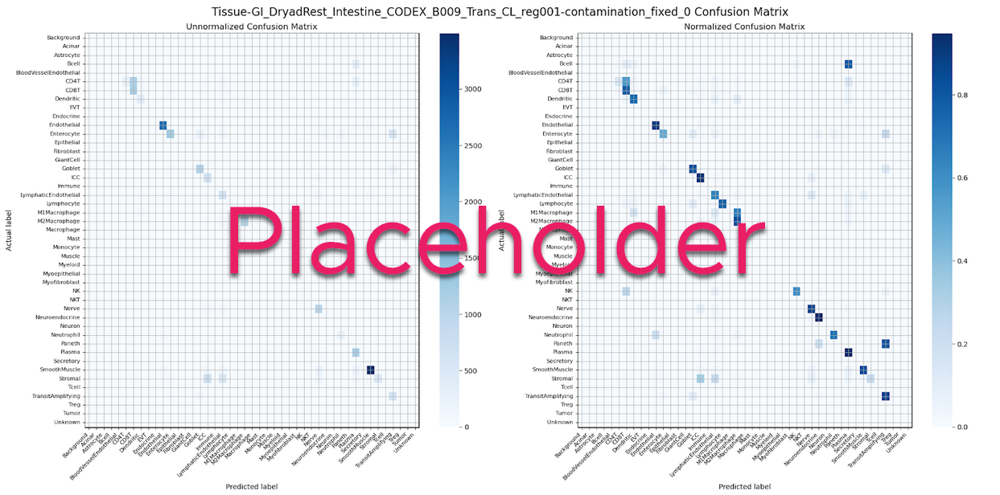

# **Companion Website for &quot;Human BioMolecular Atlas Program (HuBMAP): 3D Human Reference Atlas Construction and Usage&quot;**

Katy Börner1,\*, Philip D. Blood2,3, Jonathan C. Silverstein4, Matthew Ruffalo3, Sarah A. Teichmann5, Gloria Pryhuber6, Ravi Misra6, Jeffrey Purkerson6, Jean Fan7, John W. Hickey8, Gesmira Molla9, Chuan Xu5, Yun Zhang10 Griffin Weber11, Yashvardhan Jain1, Danial Qaurooni1, Yongxin Kong1, HRA Team, Andreas Bueckle1,\*, Bruce W. Herr II1,\*

1 Department of Intelligent Systems Engineering, Luddy School of Informatics, Computing, and Engineering, Indiana University, Bloomington, IN, USA\
2 Pittsburgh Supercomputing Center, Pittsburgh, PA, USA\
3 Carnegie Mellon University, Pittsburgh, PA, USA\
4 Department of Biomedical Informatics, University of Pittsburgh School of Medicine, Pittsburgh, PA, USA\
5 Wellcome Sanger Institute, Wellcome Genome Campus, Hinxton, Cambridge, UK\
6 University of Rochester Medical Center, Rochester, NY, USA\
7 Department of Biomedical Engineering, Johns Hopkins University, Baltimore MD, USA\
8 Department of Biomedical Engineering, Duke University, Durham, NC, USA\
9 New York Genome Center, New York, NY, USA\
10 J. Craig Venter Institute, La Jolla, CA, USA\
11 Department of Biomedical Informatics, Harvard Medical School, Boston, MA, USA\

\* Corresponding authors: \
Katy Börner, <katy@iu.edu>\
Andreas Bueckle, <abueckle@iu.edu>\
Bruce W. Herr II, <bherr@iu.edu>

---

[Link to HuBMAP Portal](https://portal.hubmapconsortium.org)\
[Link to HRA Portal](https://humanatlas.io)

---

#### **Flexible hybrid cloud microservices architecture**

 \

Permanent links to the current version used in the paper: 
 - [https://github.com/hubmapconsortium/software-docs/blob/097fea2fbf0d885df01cf6926a3c9ecaf1ed2ebf/src/HuBMAP%20Services%20Architecture.drawio](https://github.com/hubmapconsortium/software-docs/blob/097fea2fbf0d885df01cf6926a3c9ecaf1ed2ebf/src/HuBMAP%20Services%20Architecture.drawio)
 - [https://github.com/hubmapconsortium/software-docs/blob/097fea2fbf0d885df01cf6926a3c9ecaf1ed2ebf/docs/hubmap-services-arch.html](https://github.com/hubmapconsortium/software-docs/blob/097fea2fbf0d885df01cf6926a3c9ecaf1ed2ebf/docs/hubmap-services-arch.html)

---

#### **Atlas Construction and Publication**

Crosswalking tables for 3D Reference Objects:
 - Anatomical Structures, Cell Types and Biomarkers (ASCT+B) Tables to 3D Reference Object Library Mapping: [https://github.com/hubmapconsortium/ccf-releases/blob/main/v2.0/models/asct-b-3d-models-crosswalk.csv](https://github.com/hubmapconsortium/ccf-releases/blob/main/v2.0/models/asct-b-3d-models-crosswalk.csv)

Crosswalking tables for cell type annotation tools:
 - Azimuth: [https://github.com/hubmapconsortium/hra-workflows-runner/blob/main/crosswalking-tables/azimuth.csv](https://github.com/hubmapconsortium/hra-workflows-runner/blob/main/crosswalking-tables/azimuth.csv)
 - CellTypist: [https://github.com/hubmapconsortium/hra-workflows-runner/blob/main/crosswalking-tables/celltypist.csv](https://github.com/hubmapconsortium/hra-workflows-runner/blob/main/crosswalking-tables/celltypist.csv)
 - popV: [https://github.com/hubmapconsortium/hra-workflows-runner/blob/main/crosswalking-tables/popv.csv](https://github.com/hubmapconsortium/hra-workflows-runner/blob/main/crosswalking-tables/popv.csv)
 - All 3 crosswalks as graph: [https://github.com/hubmapconsortium/hra-workflows-runner/blob/main/crosswalking-tables/crosswalks.jsonld](https://github.com/hubmapconsortium/hra-workflows-runner/blob/main/crosswalking-tables/crosswalks.jsonld)

---
#### Atlas Usage: US#1-2

Explore at [https://humanatlas.io/overview-use-the-hra](https://humanatlas.io/overview-use-the-hra)

---

#### Atlas Usage: Perivascular immune cells in lung

A use case featuring an example application using the Vitessce visualization tool to visualize similar locations of healthy adult compared to pediatric lung with BPD disease to demonstrate an assessment of multiple cell types relative to nearest endothelial cell nuclei using single-cell spatial protein biomarker data.

Link to Data on Google Drive: [https://drive.google.com/drive/folders/1SPbN6_0C-mVWbfE5r2OTVZLMxBjiEKnI?usp=sharing](https://drive.google.com/drive/folders/1SPbN6_0C-mVWbfE5r2OTVZLMxBjiEKnI?usp=sharing )
Link to code on GitHub: [https://github.com/cns-iu/hra-construction-usage-supporting-information/tree/main/perivascular-immune-cells-in-lung](https://github.com/cns-iu/hra-construction-usage-supporting-information/tree/main/perivascular-immune-cells-in-lung) 

\

---

#### Atlas Usage: Hierarchical cell type populations within FTUs

A use case featuring a code template for hierarchical cell neighborhood analysis. The code was developed for analyzing cell type neighborhoods across scales and we have named some of these scales: cellular “neighborhoods”, “communities”, and “functional tissue units.” The calculation of similar cellular neighborhoods, communities, and tissue units across different scales is analogous to how we might think that people form neighborhoods, cities, and states.

Link to Data Collection on HuBMAP Portal: [https://portal.hubmapconsortium.org/browse/publication/77ab35880329b5932380104aa58795a4](https://portal.hubmapconsortium.org/browse/publication/77ab35880329b5932380104aa58795a4)
Link to worksheet on GitHub: [https://github.com/HickeyLab/Hierarchical-Tissue-Unit-Annotation](https://github.com/HickeyLab/Hierarchical-Tissue-Unit-Annotation)

\

The cell type predictions for the same dataset, using the current version of the cell type model by the van Valen lab (see Methods) are also made available at [add link]. 
Below, we show a comparison between the original STELLAR predictions (left) vs. the predictions from the current version of the cell type model (right) for one dataset. We also show a confusion matrix for the cell type categories for the same dataset.

 \

---
