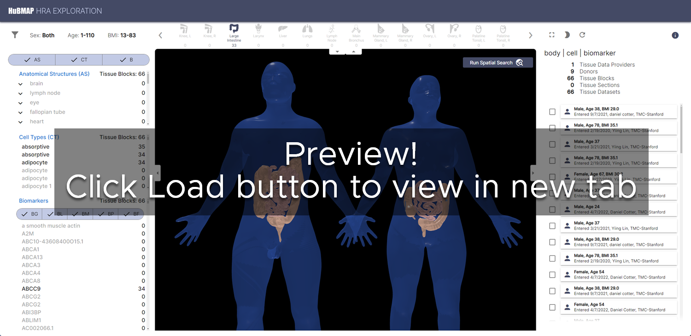
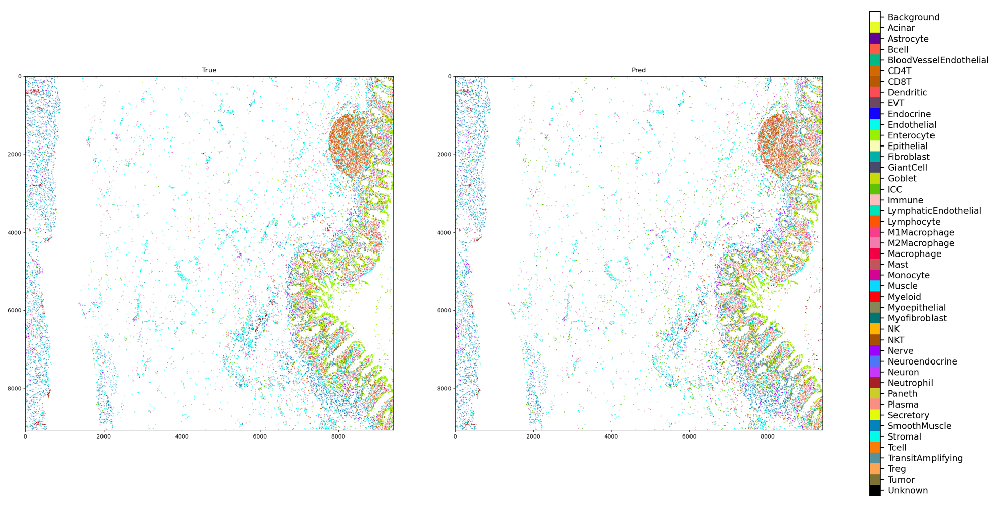

# **Supporting Information for &quot;Human BioMolecular Atlas Program (HuBMAP): 3D Human Reference Atlas Construction and Usage&quot;**

Katy Börner1,\*,2, Philip D. Blood3, Jonathan C. Silverstein4, Matthew Ruffalo5, Sarah A. Teichmann2,6, Gloria Pryhuber7, Ravi Misra7, Jeffrey Purkerson7, Jean Fan8, John W. Hickey9, Gesmira Molla10, Chuan Xu6, Yun Zhang11 Griffin Weber12, Yashvardhan Jain1, Danial Qaurooni1, Yongxin Kong1, HRA Team, Andreas Bueckle1,\*, Bruce W. Herr II1,\*

1 Department of Intelligent Systems Engineering, Luddy School of Informatics, Computing, and Engineering, Indiana University, Bloomington, IN, USA\
2 CIFAR MacMillan Multiscale Human program, CIFAR, Toronto, Canada
3 Pittsburgh Supercomputing Center, Carnegie Mellon University, Pittsburgh, PA, USA\
4 Department of Biomedical Informatics, University of Pittsburgh School of Medicine, Pittsburgh, PA, USA\
5 Ray and Stephanie Lane Computational Biology Department, Carnegie Mellon University, Pittsburgh, PA, USA
6 Wellcome Sanger Institute, Wellcome Genome Campus, Hinxton, Cambridge, UK\
7 University of Rochester Medical Center, Rochester, NY, USA\
8 Department of Biomedical Engineering, Johns Hopkins University, Baltimore MD, USA\
9 Department of Biomedical Engineering, Duke University, Durham, NC, USA\
10 New York Genome Center, New York, NY, USA\
11 J. Craig Venter Institute, La Jolla, CA, USA\
12 Department of Biomedical Informatics, Harvard Medical School, Boston, MA, USA\

\* Corresponding authors: \
Katy Börner, <katy@iu.edu>\
Andreas Bueckle, <abueckle@iu.edu>\
Bruce W. Herr II, <bherr@iu.edu>

---

[Link to HuBMAP Portal](https://portal.hubmapconsortium.org)\
[Link to HRA Portal](https://humanatlas.io)\
[Link to GitHub repository](https://github.com/cns-iu/hra-construction-usage-supporting-information)

---

#### Flexible hybrid cloud microservices architecture

<html></html>

<svg xmlns="http://www.w3.org/2000/svg" xmlns:xlink="http://www.w3.org/1999/xlink" version="1.1" width="75%" viewBox="-0.5 -0.5 1617 875" content="&lt;mxfile host=&quot;app.diagrams.net&quot; modified=&quot;2024-02-29T00:21:29.234Z&quot; agent=&quot;Mozilla/5.0 (Windows NT 10.0; Win64; x64) AppleWebKit/537.36 (KHTML, like Gecko) Chrome/122.0.0.0 Safari/537.36&quot; etag=&quot;Up45fjBSF8a_7sJXy2DC&quot; version=&quot;23.1.7&quot; type=&quot;google&quot; scale=&quot;2&quot; border=&quot;0&quot;&gt;&#10;  &lt;diagram id=&quot;j9Qyy4nKqlWBJmMirgIs&quot; name=&quot;Page-1&quot;&gt;&#10;    &lt;mxGraphModel dx=&quot;1214&quot; dy=&quot;1125&quot; grid=&quot;1&quot; gridSize=&quot;10&quot; guides=&quot;1&quot; tooltips=&quot;1&quot; connect=&quot;1&quot; arrows=&quot;1&quot; fold=&quot;1&quot; page=&quot;1&quot; pageScale=&quot;1&quot; pageWidth=&quot;850&quot; pageHeight=&quot;1100&quot; background=&quot;none&quot; math=&quot;0&quot; shadow=&quot;0&quot;&gt;&#10;      &lt;root&gt;&#10;        &lt;mxCell id=&quot;0&quot; /&gt;&#10;        &lt;mxCell id=&quot;1&quot; parent=&quot;0&quot; /&gt;&#10;        &lt;UserObject label=&quot;&quot; tooltip=&quot;Systems, data download, tools, containers and APIs operate via Globus Tokens passed through the API Gateway on every call.&quot; link=&quot;https://github.com/hubmapconsortium/gateway&quot; id=&quot;gPMXnLtjhfEc-A2dQX71-5&quot;&gt;&#10;          &lt;mxCell style=&quot;shape=partialRectangle;whiteSpace=wrap;html=1;top=1;left=1;fillColor=#FAD7AC;rounded=0;fontSize=12;strokeColor=#b46504;gradientColor=#FFF2CC;opacity=60;align=right;verticalAlign=top;&quot; parent=&quot;1&quot; vertex=&quot;1&quot;&gt;&#10;            &lt;mxGeometry x=&quot;10&quot; y=&quot;149&quot; width=&quot;550&quot; height=&quot;62&quot; as=&quot;geometry&quot; /&gt;&#10;          &lt;/mxCell&gt;&#10;        &lt;/UserObject&gt;&#10;        &lt;UserObject label=&quot;Globus Auth (Authentication and Authorization)&quot; link=&quot;https://docs.globus.org/api/auth/&quot; tooltip=&quot;Globus Auth is the OAuth2 authentication and authorization service published by Globus (not hosted by HuBMAP) used for login utilizing user’s home institution identity provider for authentication to retrieve user tokens and then used to tie users to HuBMAP-maintained groups for authorization. In future integration with NIH Research Authorization Service (RAS) users will also, via single sign-on, be associated with their dbGaP authorizations.&quot; id=&quot;ca2vOitG2DdZw0FZi5Ay-20&quot;&gt;&#10;          &lt;mxCell style=&quot;rounded=0;whiteSpace=wrap;html=1;fillColor=#fad9d5;strokeColor=#ae4132;rotation=-90;opacity=70;&quot; parent=&quot;1&quot; vertex=&quot;1&quot;&gt;&#10;            &lt;mxGeometry x=&quot;-94.05&quot; y=&quot;152.45&quot; width=&quot;312.09&quot; height=&quot;30&quot; as=&quot;geometry&quot; /&gt;&#10;          &lt;/mxCell&gt;&#10;        &lt;/UserObject&gt;&#10;        &lt;mxCell id=&quot;ca2vOitG2DdZw0FZi5Ay-16&quot; value=&quot;&quot; style=&quot;rounded=0;whiteSpace=wrap;html=1;fillColor=none;strokeColor=#737373;&quot; parent=&quot;1&quot; vertex=&quot;1&quot;&gt;&#10;          &lt;mxGeometry x=&quot;9.5&quot; y=&quot;24&quot; width=&quot;800.5&quot; height=&quot;110&quot; as=&quot;geometry&quot; /&gt;&#10;        &lt;/mxCell&gt;&#10;        &lt;mxCell id=&quot;ca2vOitG2DdZw0FZi5Ay-30&quot; value=&quot;&quot; style=&quot;rounded=0;whiteSpace=wrap;html=1;fillColor=none;strokeColor=#737373;&quot; parent=&quot;1&quot; vertex=&quot;1&quot;&gt;&#10;          &lt;mxGeometry x=&quot;10&quot; y=&quot;328&quot; width=&quot;800&quot; height=&quot;90&quot; as=&quot;geometry&quot; /&gt;&#10;        &lt;/mxCell&gt;&#10;        &lt;UserObject label=&quot;On-Prem File Store and Compute Resources&quot; tooltip=&quot;The File Store and Compute Resources are hosted in dedicated hardware at the Pittsburgh Supercomputing Center including raw and processed data managed in Globus endpoints with distinct security for public, consortium, and protected data. Databases are in AWS or at PSC as optimal for the use case.&quot; link=&quot;https://psc.edu&quot; id=&quot;ca2vOitG2DdZw0FZi5Ay-37&quot;&gt;&#10;          &lt;mxCell style=&quot;shape=partialRectangle;whiteSpace=wrap;html=1;bottom=1;right=1;fillColor=#b1ddf0;rounded=0;strokeColor=#10739E;&quot; parent=&quot;1&quot; vertex=&quot;1&quot;&gt;&#10;            &lt;mxGeometry x=&quot;490&quot; y=&quot;357&quot; width=&quot;305&quot; height=&quot;34&quot; as=&quot;geometry&quot; /&gt;&#10;          &lt;/mxCell&gt;&#10;        &lt;/UserObject&gt;&#10;        &lt;mxCell id=&quot;ca2vOitG2DdZw0FZi5Ay-17&quot; value=&quot;&quot; style=&quot;rounded=0;whiteSpace=wrap;html=1;fillColor=none;strokeColor=#737373;shadow=0;&quot; parent=&quot;1&quot; vertex=&quot;1&quot;&gt;&#10;          &lt;mxGeometry x=&quot;10&quot; y=&quot;224&quot; width=&quot;800&quot; height=&quot;90&quot; as=&quot;geometry&quot; /&gt;&#10;        &lt;/mxCell&gt;&#10;        &lt;mxCell id=&quot;R-GQj7APGcau6322Vip6-20&quot; style=&quot;edgeStyle=orthogonalEdgeStyle;rounded=0;orthogonalLoop=1;jettySize=auto;html=1;exitX=0.638;exitY=0.993;exitDx=0;exitDy=0;entryX=0.5;entryY=0;entryDx=0;entryDy=0;exitPerimeter=0;&quot; parent=&quot;1&quot; source=&quot;ca2vOitG2DdZw0FZi5Ay-24&quot; target=&quot;ca2vOitG2DdZw0FZi5Ay-44&quot; edge=&quot;1&quot;&gt;&#10;          &lt;mxGeometry relative=&quot;1&quot; as=&quot;geometry&quot;&gt;&#10;            &lt;Array as=&quot;points&quot;&gt;&#10;              &lt;mxPoint x=&quot;748&quot; y=&quot;180&quot; /&gt;&#10;              &lt;mxPoint x=&quot;748&quot; y=&quot;180&quot; /&gt;&#10;            &lt;/Array&gt;&#10;          &lt;/mxGeometry&gt;&#10;        &lt;/mxCell&gt;&#10;        &lt;UserObject label=&quot;Globus Transfer UI&quot; tooltip=&quot;Globus Transfer Application a web application hosted by Globus that allows users to initiate and track file transfers.&quot; link=&quot;https://app.globus.org&quot; id=&quot;ca2vOitG2DdZw0FZi5Ay-24&quot;&gt;&#10;          &lt;mxCell style=&quot;rounded=0;whiteSpace=wrap;html=1;fillColor=#fad9d5;strokeColor=#ae4132;opacity=70;&quot; parent=&quot;1&quot; vertex=&quot;1&quot;&gt;&#10;            &lt;mxGeometry x=&quot;691&quot; y=&quot;87&quot; width=&quot;90&quot; height=&quot;30&quot; as=&quot;geometry&quot; /&gt;&#10;          &lt;/mxCell&gt;&#10;        &lt;/UserObject&gt;&#10;        &lt;UserObject label=&quot;MySQL&quot; tooltip=&quot;MySQL is used for relational data including UUID API.&quot; link=&quot;https://www.mysql.com&quot; id=&quot;ca2vOitG2DdZw0FZi5Ay-31&quot;&gt;&#10;          &lt;mxCell style=&quot;rounded=0;whiteSpace=wrap;html=1;fillColor=#fad7ac;strokeColor=#b46504;&quot; parent=&quot;1&quot; vertex=&quot;1&quot;&gt;&#10;            &lt;mxGeometry x=&quot;86&quot; y=&quot;358&quot; width=&quot;78&quot; height=&quot;33&quot; as=&quot;geometry&quot; /&gt;&#10;          &lt;/mxCell&gt;&#10;        &lt;/UserObject&gt;&#10;        &lt;UserObject label=&quot;OpenSearch&quot; tooltip=&quot;OpenSearch Search Engine&quot; link=&quot;https://opensearch.org/&quot; id=&quot;ca2vOitG2DdZw0FZi5Ay-39&quot;&gt;&#10;          &lt;mxCell style=&quot;rounded=0;whiteSpace=wrap;html=1;fillColor=#fad7ac;strokeColor=#b46504;&quot; parent=&quot;1&quot; vertex=&quot;1&quot;&gt;&#10;            &lt;mxGeometry x=&quot;267&quot; y=&quot;358&quot; width=&quot;75&quot; height=&quot;33&quot; as=&quot;geometry&quot; /&gt;&#10;          &lt;/mxCell&gt;&#10;        &lt;/UserObject&gt;&#10;        &lt;UserObject label=&quot;Neo4j&quot; tooltip=&quot;Neo4j graph database open and free versions deployed on AWS are used for Provenance (Entity API) and Knowledge (Ontology API) backends.&quot; link=&quot;https://neo4j.com&quot; id=&quot;ca2vOitG2DdZw0FZi5Ay-40&quot;&gt;&#10;          &lt;mxCell style=&quot;rounded=0;whiteSpace=wrap;html=1;fillColor=#fad7ac;strokeColor=#b46504;&quot; parent=&quot;1&quot; vertex=&quot;1&quot;&gt;&#10;            &lt;mxGeometry x=&quot;179&quot; y=&quot;358&quot; width=&quot;75&quot; height=&quot;33&quot; as=&quot;geometry&quot; /&gt;&#10;          &lt;/mxCell&gt;&#10;        &lt;/UserObject&gt;&#10;        &lt;mxCell id=&quot;R-GQj7APGcau6322Vip6-13&quot; style=&quot;edgeStyle=orthogonalEdgeStyle;rounded=0;orthogonalLoop=1;jettySize=auto;html=1;exitX=0.5;exitY=1;exitDx=0;exitDy=0;entryX=0.844;entryY=0.004;entryDx=0;entryDy=0;entryPerimeter=0;&quot; parent=&quot;1&quot; source=&quot;ca2vOitG2DdZw0FZi5Ay-44&quot; target=&quot;ca2vOitG2DdZw0FZi5Ay-37&quot; edge=&quot;1&quot;&gt;&#10;          &lt;mxGeometry relative=&quot;1&quot; as=&quot;geometry&quot;&gt;&#10;            &lt;mxPoint x=&quot;747&quot; y=&quot;350&quot; as=&quot;targetPoint&quot; /&gt;&#10;          &lt;/mxGeometry&gt;&#10;        &lt;/mxCell&gt;&#10;        &lt;UserObject label=&quot;Globus Transfer API&quot; link=&quot;https://docs.globus.org/api/transfer/&quot; linkTarget=&quot;_blank&quot; tooltip=&quot;Globus Transfer Application and API is used by HuBMAP to enable authorized users to securely upload and download data.&quot; id=&quot;ca2vOitG2DdZw0FZi5Ay-44&quot;&gt;&#10;          &lt;mxCell style=&quot;rounded=0;whiteSpace=wrap;html=1;fillColor=#B1DDF0;strokeColor=#ae4132;&quot; parent=&quot;1&quot; vertex=&quot;1&quot;&gt;&#10;            &lt;mxGeometry x=&quot;700&quot; y=&quot;260&quot; width=&quot;95&quot; height=&quot;30&quot; as=&quot;geometry&quot; /&gt;&#10;          &lt;/mxCell&gt;&#10;        &lt;/UserObject&gt;&#10;        &lt;mxCell id=&quot;ca2vOitG2DdZw0FZi5Ay-45&quot; value=&quot;&amp;lt;font style=&amp;quot;font-size: 14px;&amp;quot;&amp;gt;Resource&amp;lt;/font&amp;gt;&quot; style=&quot;text;html=1;resizable=0;autosize=1;align=center;verticalAlign=middle;points=[];fillColor=none;strokeColor=none;rounded=0;fontSize=24;rotation=270;&quot; parent=&quot;1&quot; vertex=&quot;1&quot;&gt;&#10;          &lt;mxGeometry x=&quot;-18&quot; y=&quot;353&quot; width=&quot;80&quot; height=&quot;40&quot; as=&quot;geometry&quot; /&gt;&#10;        &lt;/mxCell&gt;&#10;        &lt;mxCell id=&quot;ca2vOitG2DdZw0FZi5Ay-46&quot; value=&quot;&amp;lt;font style=&amp;quot;font-size: 14px;&amp;quot;&amp;gt;API&amp;lt;br&amp;gt;&amp;lt;/font&amp;gt;&quot; style=&quot;text;html=1;resizable=0;autosize=1;align=center;verticalAlign=middle;points=[];fillColor=none;strokeColor=none;rounded=0;fontSize=24;rotation=270;&quot; parent=&quot;1&quot; vertex=&quot;1&quot;&gt;&#10;          &lt;mxGeometry x=&quot;-3&quot; y=&quot;247&quot; width=&quot;50&quot; height=&quot;40&quot; as=&quot;geometry&quot; /&gt;&#10;        &lt;/mxCell&gt;&#10;        &lt;mxCell id=&quot;ca2vOitG2DdZw0FZi5Ay-47&quot; value=&quot;&amp;lt;font style=&amp;quot;font-size: 14px;&amp;quot;&amp;gt;Application&amp;lt;br&amp;gt;&amp;lt;/font&amp;gt;&quot; style=&quot;text;html=1;resizable=0;autosize=1;align=center;verticalAlign=middle;points=[];fillColor=none;strokeColor=none;rounded=0;fontSize=24;rotation=270;&quot; parent=&quot;1&quot; vertex=&quot;1&quot;&gt;&#10;          &lt;mxGeometry x=&quot;-23&quot; y=&quot;65&quot; width=&quot;90&quot; height=&quot;40&quot; as=&quot;geometry&quot; /&gt;&#10;        &lt;/mxCell&gt;&#10;        &lt;mxCell id=&quot;ca2vOitG2DdZw0FZi5Ay-67&quot; style=&quot;edgeStyle=orthogonalEdgeStyle;rounded=0;jumpStyle=arc;orthogonalLoop=1;jettySize=auto;html=1;exitX=0;exitY=0.5;exitDx=0;exitDy=0;entryX=1;entryY=0.5;entryDx=0;entryDy=0;fontSize=16;endArrow=classicThin;endFill=1;&quot; parent=&quot;1&quot; source=&quot;ca2vOitG2DdZw0FZi5Ay-58&quot; target=&quot;ca2vOitG2DdZw0FZi5Ay-60&quot; edge=&quot;1&quot;&gt;&#10;          &lt;mxGeometry relative=&quot;1&quot; as=&quot;geometry&quot; /&gt;&#10;        &lt;/mxCell&gt;&#10;        &lt;mxCell id=&quot;1czwzXAxJX-QsbYgAEoH-36&quot; style=&quot;edgeStyle=orthogonalEdgeStyle;rounded=0;orthogonalLoop=1;jettySize=auto;html=1;exitX=0.5;exitY=1;exitDx=0;exitDy=0;entryX=0.25;entryY=0;entryDx=0;entryDy=0;&quot; parent=&quot;1&quot; source=&quot;ca2vOitG2DdZw0FZi5Ay-58&quot; target=&quot;ca2vOitG2DdZw0FZi5Ay-40&quot; edge=&quot;1&quot;&gt;&#10;          &lt;mxGeometry relative=&quot;1&quot; as=&quot;geometry&quot; /&gt;&#10;        &lt;/mxCell&gt;&#10;        &lt;UserObject label=&quot;Entity&quot; tooltip=&quot;Entity API is the main interface to the HuBMAP Provenance store/database. This is a standard HTTP RESTful web service providing POST/PUT/GET services for the metadata associated with Donors, Organs, Tissue Samples and Datasets.&quot; link=&quot;https://github.com/hubmapconsortium/entity-api&quot; id=&quot;ca2vOitG2DdZw0FZi5Ay-58&quot;&gt;&#10;          &lt;mxCell style=&quot;rounded=0;whiteSpace=wrap;html=1;fillColor=#fad7ac;strokeColor=#b46504;&quot; parent=&quot;1&quot; vertex=&quot;1&quot;&gt;&#10;            &lt;mxGeometry x=&quot;157&quot; y=&quot;260&quot; width=&quot;55&quot; height=&quot;30&quot; as=&quot;geometry&quot; /&gt;&#10;          &lt;/mxCell&gt;&#10;        &lt;/UserObject&gt;&#10;        &lt;mxCell id=&quot;1czwzXAxJX-QsbYgAEoH-37&quot; style=&quot;edgeStyle=orthogonalEdgeStyle;rounded=0;orthogonalLoop=1;jettySize=auto;html=1;exitX=0.5;exitY=1;exitDx=0;exitDy=0;entryX=0.359;entryY=0.024;entryDx=0;entryDy=0;entryPerimeter=0;&quot; parent=&quot;1&quot; source=&quot;ca2vOitG2DdZw0FZi5Ay-60&quot; target=&quot;ca2vOitG2DdZw0FZi5Ay-31&quot; edge=&quot;1&quot;&gt;&#10;          &lt;mxGeometry relative=&quot;1&quot; as=&quot;geometry&quot; /&gt;&#10;        &lt;/mxCell&gt;&#10;        &lt;UserObject label=&quot;UUID&quot; tooltip=&quot;UUID API is used to create and translate HuBMAP specific ids (UUIDs, HuBMAP IDs and Submission IDs). These are used to codify Donors, Tissue Samples (including organs), Datasets and other miscellaneous entities used by the provenance graph data store.&quot; link=&quot;https://github.com/hubmapconsortium/uuid-api&quot; id=&quot;ca2vOitG2DdZw0FZi5Ay-60&quot;&gt;&#10;          &lt;mxCell style=&quot;rounded=0;whiteSpace=wrap;html=1;fillColor=#fad7ac;strokeColor=#b46504;&quot; parent=&quot;1&quot; vertex=&quot;1&quot;&gt;&#10;            &lt;mxGeometry x=&quot;87&quot; y=&quot;260&quot; width=&quot;55&quot; height=&quot;30&quot; as=&quot;geometry&quot; /&gt;&#10;          &lt;/mxCell&gt;&#10;        &lt;/UserObject&gt;&#10;        &lt;mxCell id=&quot;ca2vOitG2DdZw0FZi5Ay-68&quot; style=&quot;edgeStyle=orthogonalEdgeStyle;rounded=0;jumpStyle=arc;orthogonalLoop=1;jettySize=auto;html=1;exitX=0;exitY=0.5;exitDx=0;exitDy=0;entryX=1;entryY=0.5;entryDx=0;entryDy=0;fontSize=16;endArrow=classicThin;endFill=1;&quot; parent=&quot;1&quot; source=&quot;ca2vOitG2DdZw0FZi5Ay-61&quot; target=&quot;ca2vOitG2DdZw0FZi5Ay-58&quot; edge=&quot;1&quot;&gt;&#10;          &lt;mxGeometry relative=&quot;1&quot; as=&quot;geometry&quot; /&gt;&#10;        &lt;/mxCell&gt;&#10;        &lt;mxCell id=&quot;1czwzXAxJX-QsbYgAEoH-34&quot; style=&quot;edgeStyle=orthogonalEdgeStyle;rounded=0;orthogonalLoop=1;jettySize=auto;html=1;exitX=0.5;exitY=1;exitDx=0;exitDy=0;&quot; parent=&quot;1&quot; source=&quot;ca2vOitG2DdZw0FZi5Ay-61&quot; target=&quot;ca2vOitG2DdZw0FZi5Ay-39&quot; edge=&quot;1&quot;&gt;&#10;          &lt;mxGeometry relative=&quot;1&quot; as=&quot;geometry&quot; /&gt;&#10;        &lt;/mxCell&gt;&#10;        &lt;UserObject label=&quot;Search&quot; tooltip=&quot;Search API is a search-oriented service backed by Elasticsearch holding configurable views (configured via modular transform plugin) of HuBMAP provenance data.&quot; link=&quot;https://github.com/hubmapconsortium/search-api&quot; id=&quot;ca2vOitG2DdZw0FZi5Ay-61&quot;&gt;&#10;          &lt;mxCell style=&quot;rounded=0;whiteSpace=wrap;html=1;fillColor=#fad7ac;strokeColor=#b46504;&quot; parent=&quot;1&quot; vertex=&quot;1&quot;&gt;&#10;            &lt;mxGeometry x=&quot;226&quot; y=&quot;260&quot; width=&quot;64&quot; height=&quot;30&quot; as=&quot;geometry&quot; /&gt;&#10;          &lt;/mxCell&gt;&#10;        &lt;/UserObject&gt;&#10;        &lt;mxCell id=&quot;1czwzXAxJX-QsbYgAEoH-44&quot; style=&quot;edgeStyle=orthogonalEdgeStyle;rounded=0;orthogonalLoop=1;jettySize=auto;html=1;exitX=0.5;exitY=1;exitDx=0;exitDy=0;entryX=0.281;entryY=0;entryDx=0;entryDy=0;entryPerimeter=0;&quot; parent=&quot;1&quot; source=&quot;ca2vOitG2DdZw0FZi5Ay-62&quot; target=&quot;ca2vOitG2DdZw0FZi5Ay-37&quot; edge=&quot;1&quot;&gt;&#10;          &lt;mxGeometry relative=&quot;1&quot; as=&quot;geometry&quot;&gt;&#10;            &lt;mxPoint x=&quot;586&quot; y=&quot;350&quot; as=&quot;targetPoint&quot; /&gt;&#10;            &lt;Array as=&quot;points&quot;&gt;&#10;              &lt;mxPoint x=&quot;575&quot; y=&quot;357&quot; /&gt;&#10;            &lt;/Array&gt;&#10;          &lt;/mxGeometry&gt;&#10;        &lt;/mxCell&gt;&#10;        &lt;UserObject label=&quot;Workspaces&quot; tooltip=&quot;The Workspaces API enables the creation of user workspaces used to run analysis against HuBMAP data using on-prem compute resources.&quot; link=&quot;https://github.com/hubmapconsortium/user_workspaces_server&quot; id=&quot;ca2vOitG2DdZw0FZi5Ay-62&quot;&gt;&#10;          &lt;mxCell style=&quot;rounded=0;whiteSpace=wrap;html=1;fillColor=#b1ddf0;strokeColor=#10739e;&quot; parent=&quot;1&quot; vertex=&quot;1&quot;&gt;&#10;            &lt;mxGeometry x=&quot;539&quot; y=&quot;260&quot; width=&quot;72&quot; height=&quot;30&quot; as=&quot;geometry&quot; /&gt;&#10;          &lt;/mxCell&gt;&#10;        &lt;/UserObject&gt;&#10;        &lt;mxCell id=&quot;R-GQj7APGcau6322Vip6-12&quot; style=&quot;edgeStyle=orthogonalEdgeStyle;rounded=0;orthogonalLoop=1;jettySize=auto;html=1;exitX=0.5;exitY=1;exitDx=0;exitDy=0;entryX=0.565;entryY=-0.018;entryDx=0;entryDy=0;entryPerimeter=0;&quot; parent=&quot;1&quot; source=&quot;ca2vOitG2DdZw0FZi5Ay-64&quot; target=&quot;ca2vOitG2DdZw0FZi5Ay-37&quot; edge=&quot;1&quot;&gt;&#10;          &lt;mxGeometry relative=&quot;1&quot; as=&quot;geometry&quot; /&gt;&#10;        &lt;/mxCell&gt;&#10;        &lt;UserObject label=&quot;Ingest&quot; tooltip=&quot;Ingest API is used mainly by the Ingest UI to provide application specific functionality for the data ingest/provenance. A main function is to interact with the local PSC HIVE file system and is therefore installed at the PSC instead of AWS.&quot; link=&quot;https://github.com/hubmapconsortium/ingest-api&quot; id=&quot;ca2vOitG2DdZw0FZi5Ay-64&quot;&gt;&#10;          &lt;mxCell style=&quot;rounded=0;whiteSpace=wrap;html=1;fillColor=#b1ddf0;strokeColor=#10739e;&quot; parent=&quot;1&quot; vertex=&quot;1&quot;&gt;&#10;            &lt;mxGeometry x=&quot;635&quot; y=&quot;260&quot; width=&quot;55&quot; height=&quot;30&quot; as=&quot;geometry&quot; /&gt;&#10;          &lt;/mxCell&gt;&#10;        &lt;/UserObject&gt;&#10;        &lt;mxCell id=&quot;1czwzXAxJX-QsbYgAEoH-33&quot; style=&quot;edgeStyle=orthogonalEdgeStyle;rounded=0;orthogonalLoop=1;jettySize=auto;html=1;exitX=0.409;exitY=1.01;exitDx=0;exitDy=0;entryX=0.379;entryY=0;entryDx=0;entryDy=0;entryPerimeter=0;exitPerimeter=0;&quot; parent=&quot;1&quot; source=&quot;ca2vOitG2DdZw0FZi5Ay-65&quot; target=&quot;1czwzXAxJX-QsbYgAEoH-12&quot; edge=&quot;1&quot;&gt;&#10;          &lt;mxGeometry relative=&quot;1&quot; as=&quot;geometry&quot;&gt;&#10;            &lt;Array as=&quot;points&quot; /&gt;&#10;          &lt;/mxGeometry&gt;&#10;        &lt;/mxCell&gt;&#10;        &lt;UserObject label=&quot;Cells&quot; tooltip=&quot;Cells API provides the capability to search for data from indexed cell molecular information.&quot; link=&quot;https://github.com/hubmapconsortium/cross_modality_query&quot; id=&quot;ca2vOitG2DdZw0FZi5Ay-65&quot;&gt;&#10;          &lt;mxCell style=&quot;rounded=0;whiteSpace=wrap;html=1;fillColor=#fad7ac;strokeColor=#b46504;&quot; parent=&quot;1&quot; vertex=&quot;1&quot;&gt;&#10;            &lt;mxGeometry x=&quot;361.5&quot; y=&quot;260&quot; width=&quot;55&quot; height=&quot;30&quot; as=&quot;geometry&quot; /&gt;&#10;          &lt;/mxCell&gt;&#10;        &lt;/UserObject&gt;&#10;        &lt;mxCell id=&quot;1czwzXAxJX-QsbYgAEoH-35&quot; style=&quot;edgeStyle=orthogonalEdgeStyle;rounded=0;orthogonalLoop=1;jettySize=auto;html=1;exitX=0.5;exitY=1;exitDx=0;exitDy=0;entryX=0.75;entryY=0;entryDx=0;entryDy=0;jumpStyle=arc;&quot; parent=&quot;1&quot; source=&quot;ca2vOitG2DdZw0FZi5Ay-66&quot; target=&quot;ca2vOitG2DdZw0FZi5Ay-40&quot; edge=&quot;1&quot;&gt;&#10;          &lt;mxGeometry relative=&quot;1&quot; as=&quot;geometry&quot;&gt;&#10;            &lt;Array as=&quot;points&quot;&gt;&#10;              &lt;mxPoint x=&quot;321&quot; y=&quot;304&quot; /&gt;&#10;              &lt;mxPoint x=&quot;235&quot; y=&quot;304&quot; /&gt;&#10;            &lt;/Array&gt;&#10;          &lt;/mxGeometry&gt;&#10;        &lt;/mxCell&gt;&#10;        &lt;UserObject label=&quot;Ontology&quot; tooltip=&quot;Ontology API provides concept, code and term traversal within a unified knowledge graph derived from standard ontologies and application specific terminologies with its model schema enabling efficient intra ontology navigation and cross ontology translation.&quot; link=&quot;https://github.com/hubmapconsortium/ontology-api&quot; id=&quot;ca2vOitG2DdZw0FZi5Ay-66&quot;&gt;&#10;          &lt;mxCell style=&quot;rounded=0;whiteSpace=wrap;html=1;fillColor=#fad7ac;strokeColor=#b46504;&quot; parent=&quot;1&quot; vertex=&quot;1&quot;&gt;&#10;            &lt;mxGeometry x=&quot;298&quot; y=&quot;260&quot; width=&quot;55&quot; height=&quot;30&quot; as=&quot;geometry&quot; /&gt;&#10;          &lt;/mxCell&gt;&#10;        &lt;/UserObject&gt;&#10;        &lt;mxCell id=&quot;R-GQj7APGcau6322Vip6-7&quot; style=&quot;edgeStyle=orthogonalEdgeStyle;rounded=0;orthogonalLoop=1;jettySize=auto;html=1;exitX=0;exitY=0.5;exitDx=0;exitDy=0;entryX=1;entryY=0.5;entryDx=0;entryDy=0;&quot; parent=&quot;1&quot; source=&quot;ca2vOitG2DdZw0FZi5Ay-96&quot; target=&quot;ca2vOitG2DdZw0FZi5Ay-98&quot; edge=&quot;1&quot;&gt;&#10;          &lt;mxGeometry relative=&quot;1&quot; as=&quot;geometry&quot; /&gt;&#10;        &lt;/mxCell&gt;&#10;        &lt;mxCell id=&quot;1czwzXAxJX-QsbYgAEoH-26&quot; style=&quot;edgeStyle=orthogonalEdgeStyle;rounded=0;orthogonalLoop=1;jettySize=auto;html=1;exitX=0.5;exitY=1;exitDx=0;exitDy=0;entryX=0.544;entryY=0.02;entryDx=0;entryDy=0;entryPerimeter=0;&quot; parent=&quot;1&quot; source=&quot;ca2vOitG2DdZw0FZi5Ay-96&quot; target=&quot;ca2vOitG2DdZw0FZi5Ay-61&quot; edge=&quot;1&quot;&gt;&#10;          &lt;mxGeometry relative=&quot;1&quot; as=&quot;geometry&quot;&gt;&#10;            &lt;Array as=&quot;points&quot;&gt;&#10;              &lt;mxPoint x=&quot;430&quot; y=&quot;117&quot; /&gt;&#10;              &lt;mxPoint x=&quot;430&quot; y=&quot;197&quot; /&gt;&#10;              &lt;mxPoint x=&quot;261&quot; y=&quot;197&quot; /&gt;&#10;            &lt;/Array&gt;&#10;          &lt;/mxGeometry&gt;&#10;        &lt;/mxCell&gt;&#10;        &lt;mxCell id=&quot;1czwzXAxJX-QsbYgAEoH-27&quot; style=&quot;edgeStyle=orthogonalEdgeStyle;rounded=0;orthogonalLoop=1;jettySize=auto;html=1;exitX=0.345;exitY=1.005;exitDx=0;exitDy=0;exitPerimeter=0;entryX=0.5;entryY=0;entryDx=0;entryDy=0;&quot; parent=&quot;1&quot; source=&quot;ca2vOitG2DdZw0FZi5Ay-96&quot; target=&quot;ca2vOitG2DdZw0FZi5Ay-58&quot; edge=&quot;1&quot;&gt;&#10;          &lt;mxGeometry relative=&quot;1&quot; as=&quot;geometry&quot;&gt;&#10;            &lt;mxPoint x=&quot;420&quot; y=&quot;112&quot; as=&quot;sourcePoint&quot; /&gt;&#10;            &lt;mxPoint x=&quot;185.02857142857147&quot; y=&quot;255&quot; as=&quot;targetPoint&quot; /&gt;&#10;            &lt;Array as=&quot;points&quot;&gt;&#10;              &lt;mxPoint x=&quot;420&quot; y=&quot;175&quot; /&gt;&#10;              &lt;mxPoint x=&quot;185&quot; y=&quot;175&quot; /&gt;&#10;            &lt;/Array&gt;&#10;          &lt;/mxGeometry&gt;&#10;        &lt;/mxCell&gt;&#10;        &lt;mxCell id=&quot;1czwzXAxJX-QsbYgAEoH-31&quot; style=&quot;edgeStyle=orthogonalEdgeStyle;rounded=0;orthogonalLoop=1;jettySize=auto;html=1;&quot; parent=&quot;1&quot; edge=&quot;1&quot;&gt;&#10;          &lt;mxGeometry relative=&quot;1&quot; as=&quot;geometry&quot;&gt;&#10;            &lt;mxPoint x=&quot;440&quot; y=&quot;118&quot; as=&quot;sourcePoint&quot; /&gt;&#10;            &lt;mxPoint x=&quot;490&quot; y=&quot;366&quot; as=&quot;targetPoint&quot; /&gt;&#10;            &lt;Array as=&quot;points&quot;&gt;&#10;              &lt;mxPoint x=&quot;440&quot; y=&quot;118&quot; /&gt;&#10;              &lt;mxPoint x=&quot;440&quot; y=&quot;366&quot; /&gt;&#10;            &lt;/Array&gt;&#10;          &lt;/mxGeometry&gt;&#10;        &lt;/mxCell&gt;&#10;        &lt;mxCell id=&quot;1czwzXAxJX-QsbYgAEoH-38&quot; style=&quot;edgeStyle=orthogonalEdgeStyle;rounded=0;orthogonalLoop=1;jettySize=auto;html=1;jumpStyle=arc;&quot; parent=&quot;1&quot; target=&quot;ca2vOitG2DdZw0FZi5Ay-66&quot; edge=&quot;1&quot;&gt;&#10;          &lt;mxGeometry relative=&quot;1&quot; as=&quot;geometry&quot;&gt;&#10;            &lt;mxPoint x=&quot;410&quot; y=&quot;120&quot; as=&quot;sourcePoint&quot; /&gt;&#10;            &lt;Array as=&quot;points&quot;&gt;&#10;              &lt;mxPoint x=&quot;410&quot; y=&quot;118&quot; /&gt;&#10;              &lt;mxPoint x=&quot;410&quot; y=&quot;167&quot; /&gt;&#10;              &lt;mxPoint x=&quot;326&quot; y=&quot;167&quot; /&gt;&#10;            &lt;/Array&gt;&#10;          &lt;/mxGeometry&gt;&#10;        &lt;/mxCell&gt;&#10;        &lt;mxCell id=&quot;1czwzXAxJX-QsbYgAEoH-46&quot; style=&quot;edgeStyle=orthogonalEdgeStyle;rounded=0;orthogonalLoop=1;jettySize=auto;html=1;exitX=1;exitY=1;exitDx=0;exitDy=0;entryX=0.25;entryY=0;entryDx=0;entryDy=0;jumpStyle=arc;&quot; parent=&quot;1&quot; source=&quot;ca2vOitG2DdZw0FZi5Ay-96&quot; target=&quot;ca2vOitG2DdZw0FZi5Ay-64&quot; edge=&quot;1&quot;&gt;&#10;          &lt;mxGeometry relative=&quot;1&quot; as=&quot;geometry&quot;&gt;&#10;            &lt;Array as=&quot;points&quot;&gt;&#10;              &lt;mxPoint x=&quot;456&quot; y=&quot;170&quot; /&gt;&#10;              &lt;mxPoint x=&quot;649&quot; y=&quot;170&quot; /&gt;&#10;            &lt;/Array&gt;&#10;          &lt;/mxGeometry&gt;&#10;        &lt;/mxCell&gt;&#10;        &lt;UserObject label=&quot;Ingest UI&quot; tooltip=&quot;Ingest UI is a web application where Donors, Organs, Tissue Samples and Datasets are submitted. Information registered via ingest UI is stored in the provenance database (Entity API). To upload/ingest data users are directed to the Globus Transfer application.&quot; link=&quot;https://ingest.hubmapconsortium.org&quot; id=&quot;ca2vOitG2DdZw0FZi5Ay-96&quot;&gt;&#10;          &lt;mxCell style=&quot;rounded=0;whiteSpace=wrap;html=1;fillColor=#fad7ac;strokeColor=#b46504;&quot; parent=&quot;1&quot; vertex=&quot;1&quot;&gt;&#10;            &lt;mxGeometry x=&quot;401&quot; y=&quot;87&quot; width=&quot;55&quot; height=&quot;30&quot; as=&quot;geometry&quot; /&gt;&#10;          &lt;/mxCell&gt;&#10;        &lt;/UserObject&gt;&#10;        &lt;UserObject label=&quot;RUI&quot; tooltip=&quot;RUI (Registration User Interface) is used to spatially register tissue samples within their organ of origin.&quot; link=&quot;https://hubmapconsortium.github.io/ccf-ui/rui/&quot; id=&quot;ca2vOitG2DdZw0FZi5Ay-98&quot;&gt;&#10;          &lt;mxCell style=&quot;rounded=0;whiteSpace=wrap;html=1;fillColor=#fad7ac;strokeColor=#b46504;&quot; parent=&quot;1&quot; vertex=&quot;1&quot;&gt;&#10;            &lt;mxGeometry x=&quot;324&quot; y=&quot;87&quot; width=&quot;55&quot; height=&quot;30&quot; as=&quot;geometry&quot; /&gt;&#10;          &lt;/mxCell&gt;&#10;        &lt;/UserObject&gt;&#10;        &lt;mxCell id=&quot;1czwzXAxJX-QsbYgAEoH-24&quot; style=&quot;edgeStyle=orthogonalEdgeStyle;rounded=0;orthogonalLoop=1;jettySize=auto;html=1;exitX=0.25;exitY=1;exitDx=0;exitDy=0;entryX=0.7;entryY=-0.02;entryDx=0;entryDy=0;jumpStyle=arc;entryPerimeter=0;&quot; parent=&quot;1&quot; source=&quot;ca2vOitG2DdZw0FZi5Ay-99&quot; target=&quot;ca2vOitG2DdZw0FZi5Ay-61&quot; edge=&quot;1&quot;&gt;&#10;          &lt;mxGeometry relative=&quot;1&quot; as=&quot;geometry&quot;&gt;&#10;            &lt;Array as=&quot;points&quot;&gt;&#10;              &lt;mxPoint x=&quot;270&quot; y=&quot;117&quot; /&gt;&#10;              &lt;mxPoint x=&quot;270&quot; y=&quot;242&quot; /&gt;&#10;            &lt;/Array&gt;&#10;          &lt;/mxGeometry&gt;&#10;        &lt;/mxCell&gt;&#10;        &lt;UserObject label=&quot;EUI&quot; tooltip=&quot;EUI (Exploration User Interface) is used to search and view tissue samples in the location as registered via the RUI.&quot; link=&quot;https://portal.hubmapconsortium.org/ccf-eui&quot; id=&quot;ca2vOitG2DdZw0FZi5Ay-99&quot;&gt;&#10;          &lt;mxCell style=&quot;rounded=0;whiteSpace=wrap;html=1;fillColor=#fad7ac;strokeColor=#b46504;&quot; parent=&quot;1&quot; vertex=&quot;1&quot;&gt;&#10;            &lt;mxGeometry x=&quot;254&quot; y=&quot;87&quot; width=&quot;52&quot; height=&quot;30&quot; as=&quot;geometry&quot; /&gt;&#10;          &lt;/mxCell&gt;&#10;        &lt;/UserObject&gt;&#10;        &lt;mxCell id=&quot;1czwzXAxJX-QsbYgAEoH-47&quot; style=&quot;edgeStyle=orthogonalEdgeStyle;rounded=0;orthogonalLoop=1;jettySize=auto;html=1;exitX=0.75;exitY=1;exitDx=0;exitDy=0;&quot; parent=&quot;1&quot; source=&quot;ca2vOitG2DdZw0FZi5Ay-102&quot; target=&quot;ca2vOitG2DdZw0FZi5Ay-64&quot; edge=&quot;1&quot;&gt;&#10;          &lt;mxGeometry relative=&quot;1&quot; as=&quot;geometry&quot;&gt;&#10;            &lt;Array as=&quot;points&quot;&gt;&#10;              &lt;mxPoint x=&quot;530&quot; y=&quot;117&quot; /&gt;&#10;              &lt;mxPoint x=&quot;530&quot; y=&quot;160&quot; /&gt;&#10;              &lt;mxPoint x=&quot;663&quot; y=&quot;160&quot; /&gt;&#10;            &lt;/Array&gt;&#10;          &lt;/mxGeometry&gt;&#10;        &lt;/mxCell&gt;&#10;        &lt;mxCell id=&quot;1czwzXAxJX-QsbYgAEoH-49&quot; style=&quot;edgeStyle=orthogonalEdgeStyle;rounded=0;orthogonalLoop=1;jettySize=auto;html=1;exitX=1;exitY=1;exitDx=0;exitDy=0;entryX=0.417;entryY=0.021;entryDx=0;entryDy=0;entryPerimeter=0;&quot; parent=&quot;1&quot; source=&quot;ca2vOitG2DdZw0FZi5Ay-102&quot; target=&quot;ca2vOitG2DdZw0FZi5Ay-37&quot; edge=&quot;1&quot;&gt;&#10;          &lt;mxGeometry relative=&quot;1&quot; as=&quot;geometry&quot;&gt;&#10;            &lt;Array as=&quot;points&quot;&gt;&#10;              &lt;mxPoint x=&quot;539&quot; y=&quot;130&quot; /&gt;&#10;              &lt;mxPoint x=&quot;570&quot; y=&quot;130&quot; /&gt;&#10;              &lt;mxPoint x=&quot;570&quot; y=&quot;237&quot; /&gt;&#10;              &lt;mxPoint x=&quot;617&quot; y=&quot;237&quot; /&gt;&#10;            &lt;/Array&gt;&#10;          &lt;/mxGeometry&gt;&#10;        &lt;/mxCell&gt;&#10;        &lt;UserObject label=&quot;Ingest Pipeline&quot; tooltip=&quot;Ingest Pipeline is the main pipeline wrapper called within AirFlow to execute validation and analysis pipelines based on information drawn from the Entity and Ingest APIs. Ingest Pipeline also coordinates dataset status updates and the creation of new datasets with Ingest API.&quot; link=&quot;https://github.com/hubmapconsortium/ingest-pipeline&quot; id=&quot;ca2vOitG2DdZw0FZi5Ay-102&quot;&gt;&#10;          &lt;mxCell style=&quot;rounded=0;whiteSpace=wrap;html=1;fillColor=#b1ddf0;strokeColor=#10739e;&quot; parent=&quot;1&quot; vertex=&quot;1&quot;&gt;&#10;            &lt;mxGeometry x=&quot;479&quot; y=&quot;87&quot; width=&quot;60&quot; height=&quot;30&quot; as=&quot;geometry&quot; /&gt;&#10;          &lt;/mxCell&gt;&#10;        &lt;/UserObject&gt;&#10;        &lt;mxCell id=&quot;R-GQj7APGcau6322Vip6-23&quot; style=&quot;edgeStyle=orthogonalEdgeStyle;rounded=0;orthogonalLoop=1;jettySize=auto;html=1;exitX=0.85;exitY=1.048;exitDx=0;exitDy=0;entryX=0.5;entryY=0;entryDx=0;entryDy=0;exitPerimeter=0;&quot; parent=&quot;1&quot; source=&quot;gPMXnLtjhfEc-A2dQX71-15&quot; target=&quot;gPMXnLtjhfEc-A2dQX71-8&quot; edge=&quot;1&quot;&gt;&#10;          &lt;mxGeometry relative=&quot;1&quot; as=&quot;geometry&quot; /&gt;&#10;        &lt;/mxCell&gt;&#10;        &lt;mxCell id=&quot;1czwzXAxJX-QsbYgAEoH-14&quot; style=&quot;edgeStyle=orthogonalEdgeStyle;rounded=0;orthogonalLoop=1;jettySize=auto;html=1;exitX=0.5;exitY=1;exitDx=0;exitDy=0;entryX=0.454;entryY=-0.006;entryDx=0;entryDy=0;entryPerimeter=0;jumpStyle=arc;&quot; parent=&quot;1&quot; source=&quot;ca2vOitG2DdZw0FZi5Ay-103&quot; target=&quot;ca2vOitG2DdZw0FZi5Ay-37&quot; edge=&quot;1&quot;&gt;&#10;          &lt;mxGeometry relative=&quot;1&quot; as=&quot;geometry&quot;&gt;&#10;            &lt;Array as=&quot;points&quot;&gt;&#10;              &lt;mxPoint x=&quot;579&quot; y=&quot;140&quot; /&gt;&#10;              &lt;mxPoint x=&quot;629&quot; y=&quot;140&quot; /&gt;&#10;            &lt;/Array&gt;&#10;          &lt;/mxGeometry&gt;&#10;        &lt;/mxCell&gt;&#10;        &lt;UserObject label=&quot;Analysis Pipeline&quot; tooltip=&quot;Analysis Pipelines analyze data from the assays supported. Each pipeline has its own GitHub repository and associated Common Workflow Language (CWL) and Docker container(s).&quot; link=&quot;http://hubmap.scs.cmu.edu/documentation/&quot; id=&quot;ca2vOitG2DdZw0FZi5Ay-103&quot;&gt;&#10;          &lt;mxCell style=&quot;rounded=0;whiteSpace=wrap;html=1;fillColor=#b1ddf0;strokeColor=#10739e;&quot; parent=&quot;1&quot; vertex=&quot;1&quot;&gt;&#10;            &lt;mxGeometry x=&quot;549&quot; y=&quot;87&quot; width=&quot;60&quot; height=&quot;30&quot; as=&quot;geometry&quot; /&gt;&#10;          &lt;/mxCell&gt;&#10;        &lt;/UserObject&gt;&#10;        &lt;mxCell id=&quot;1czwzXAxJX-QsbYgAEoH-13&quot; style=&quot;edgeStyle=orthogonalEdgeStyle;rounded=0;orthogonalLoop=1;jettySize=auto;html=1;exitX=0.864;exitY=1.024;exitDx=0;exitDy=0;entryX=0.67;entryY=0.006;entryDx=0;entryDy=0;entryPerimeter=0;exitPerimeter=0;&quot; parent=&quot;1&quot; source=&quot;gPMXnLtjhfEc-A2dQX71-8&quot; target=&quot;ca2vOitG2DdZw0FZi5Ay-37&quot; edge=&quot;1&quot;&gt;&#10;          &lt;mxGeometry relative=&quot;1&quot; as=&quot;geometry&quot; /&gt;&#10;        &lt;/mxCell&gt;&#10;        &lt;UserObject label=&quot;Azimuth&quot; tooltip=&quot;Azimuth is an analysis tool that uses an annotated reference dataset to automate the processing, analysis, and interpretation of a new single-cell RNA-seq or ATAC-seq experiment.&quot; link=&quot;https://azimuth.hubmapconsortium.org&quot; id=&quot;gPMXnLtjhfEc-A2dQX71-8&quot;&gt;&#10;          &lt;mxCell style=&quot;rounded=0;whiteSpace=wrap;html=1;fillColor=#b1ddf0;strokeColor=#10739e;&quot; parent=&quot;1&quot; vertex=&quot;1&quot;&gt;&#10;            &lt;mxGeometry x=&quot;619&quot; y=&quot;87&quot; width=&quot;60&quot; height=&quot;30&quot; as=&quot;geometry&quot; /&gt;&#10;          &lt;/mxCell&gt;&#10;        &lt;/UserObject&gt;&#10;        &lt;mxCell id=&quot;R-GQj7APGcau6322Vip6-21&quot; style=&quot;edgeStyle=orthogonalEdgeStyle;rounded=0;orthogonalLoop=1;jettySize=auto;html=1;exitX=0.5;exitY=1;exitDx=0;exitDy=0;entryX=0.5;entryY=0;entryDx=0;entryDy=0;&quot; parent=&quot;1&quot; source=&quot;gPMXnLtjhfEc-A2dQX71-15&quot; target=&quot;ca2vOitG2DdZw0FZi5Ay-103&quot; edge=&quot;1&quot;&gt;&#10;          &lt;mxGeometry relative=&quot;1&quot; as=&quot;geometry&quot; /&gt;&#10;        &lt;/mxCell&gt;&#10;        &lt;UserObject label=&quot;Apache Airflow Pipeline Manager&quot; tooltip=&quot;Apache Airflow is a workflow management application deployed at the PSC used for running, monitoring and returning responses from analysis and validation pipelines.&quot; link=&quot;https://airflow.apache.org&quot; id=&quot;gPMXnLtjhfEc-A2dQX71-15&quot;&gt;&#10;          &lt;mxCell style=&quot;rounded=0;whiteSpace=wrap;html=1;fillColor=#b1ddf0;strokeColor=#10739e;&quot; parent=&quot;1&quot; vertex=&quot;1&quot;&gt;&#10;            &lt;mxGeometry x=&quot;479&quot; y=&quot;39&quot; width=&quot;200&quot; height=&quot;30&quot; as=&quot;geometry&quot; /&gt;&#10;          &lt;/mxCell&gt;&#10;        &lt;/UserObject&gt;&#10;        &lt;mxCell id=&quot;R-GQj7APGcau6322Vip6-24&quot; style=&quot;edgeStyle=orthogonalEdgeStyle;rounded=0;orthogonalLoop=1;jettySize=auto;html=1;jumpStyle=none;&quot; parent=&quot;1&quot; edge=&quot;1&quot;&gt;&#10;          &lt;mxGeometry relative=&quot;1&quot; as=&quot;geometry&quot;&gt;&#10;            &lt;Array as=&quot;points&quot;&gt;&#10;              &lt;mxPoint x=&quot;170&quot; y=&quot;259&quot; /&gt;&#10;            &lt;/Array&gt;&#10;            &lt;mxPoint x=&quot;170&quot; y=&quot;118&quot; as=&quot;sourcePoint&quot; /&gt;&#10;            &lt;mxPoint x=&quot;170&quot; y=&quot;259&quot; as=&quot;targetPoint&quot; /&gt;&#10;          &lt;/mxGeometry&gt;&#10;        &lt;/mxCell&gt;&#10;        &lt;mxCell id=&quot;R-GQj7APGcau6322Vip6-25&quot; style=&quot;edgeStyle=orthogonalEdgeStyle;rounded=0;orthogonalLoop=1;jettySize=auto;html=1;entryX=0.369;entryY=-0.02;entryDx=0;entryDy=0;jumpStyle=arc;entryPerimeter=0;&quot; parent=&quot;1&quot; target=&quot;ca2vOitG2DdZw0FZi5Ay-61&quot; edge=&quot;1&quot;&gt;&#10;          &lt;mxGeometry relative=&quot;1&quot; as=&quot;geometry&quot;&gt;&#10;            &lt;Array as=&quot;points&quot;&gt;&#10;              &lt;mxPoint x=&quot;180&quot; y=&quot;117&quot; /&gt;&#10;              &lt;mxPoint x=&quot;180&quot; y=&quot;167&quot; /&gt;&#10;              &lt;mxPoint x=&quot;250&quot; y=&quot;167&quot; /&gt;&#10;            &lt;/Array&gt;&#10;            &lt;mxPoint x=&quot;180&quot; y=&quot;117&quot; as=&quot;sourcePoint&quot; /&gt;&#10;          &lt;/mxGeometry&gt;&#10;        &lt;/mxCell&gt;&#10;        &lt;mxCell id=&quot;1czwzXAxJX-QsbYgAEoH-28&quot; style=&quot;edgeStyle=orthogonalEdgeStyle;rounded=0;orthogonalLoop=1;jettySize=auto;html=1;entryX=0.167;entryY=-0.007;entryDx=0;entryDy=0;jumpStyle=arc;entryPerimeter=0;&quot; parent=&quot;1&quot; target=&quot;ca2vOitG2DdZw0FZi5Ay-66&quot; edge=&quot;1&quot;&gt;&#10;          &lt;mxGeometry relative=&quot;1&quot; as=&quot;geometry&quot;&gt;&#10;            &lt;mxPoint x=&quot;190&quot; y=&quot;117&quot; as=&quot;sourcePoint&quot; /&gt;&#10;            &lt;Array as=&quot;points&quot;&gt;&#10;              &lt;mxPoint x=&quot;190&quot; y=&quot;117&quot; /&gt;&#10;              &lt;mxPoint x=&quot;190&quot; y=&quot;157&quot; /&gt;&#10;              &lt;mxPoint x=&quot;307&quot; y=&quot;157&quot; /&gt;&#10;            &lt;/Array&gt;&#10;          &lt;/mxGeometry&gt;&#10;        &lt;/mxCell&gt;&#10;        &lt;mxCell id=&quot;1czwzXAxJX-QsbYgAEoH-32&quot; style=&quot;edgeStyle=orthogonalEdgeStyle;rounded=0;orthogonalLoop=1;jettySize=auto;html=1;jumpStyle=arc;&quot; parent=&quot;1&quot; target=&quot;ca2vOitG2DdZw0FZi5Ay-65&quot; edge=&quot;1&quot;&gt;&#10;          &lt;mxGeometry relative=&quot;1&quot; as=&quot;geometry&quot;&gt;&#10;            &lt;mxPoint x=&quot;200&quot; y=&quot;117&quot; as=&quot;sourcePoint&quot; /&gt;&#10;            &lt;Array as=&quot;points&quot;&gt;&#10;              &lt;mxPoint x=&quot;200&quot; y=&quot;117&quot; /&gt;&#10;              &lt;mxPoint x=&quot;200&quot; y=&quot;147&quot; /&gt;&#10;              &lt;mxPoint x=&quot;390&quot; y=&quot;147&quot; /&gt;&#10;            &lt;/Array&gt;&#10;          &lt;/mxGeometry&gt;&#10;        &lt;/mxCell&gt;&#10;        &lt;mxCell id=&quot;1czwzXAxJX-QsbYgAEoH-39&quot; style=&quot;edgeStyle=orthogonalEdgeStyle;rounded=0;orthogonalLoop=1;jettySize=auto;html=1;exitX=0.692;exitY=0.986;exitDx=0;exitDy=0;entryX=0.183;entryY=-0.038;entryDx=0;entryDy=0;jumpStyle=arc;exitPerimeter=0;entryPerimeter=0;&quot; parent=&quot;1&quot; source=&quot;ca2vOitG2DdZw0FZi5Ay-101&quot; target=&quot;R-GQj7APGcau6322Vip6-8&quot; edge=&quot;1&quot;&gt;&#10;          &lt;mxGeometry relative=&quot;1&quot; as=&quot;geometry&quot;&gt;&#10;            &lt;Array as=&quot;points&quot;&gt;&#10;              &lt;mxPoint x=&quot;211&quot; y=&quot;140&quot; /&gt;&#10;              &lt;mxPoint x=&quot;490&quot; y=&quot;140&quot; /&gt;&#10;              &lt;mxPoint x=&quot;490&quot; y=&quot;259&quot; /&gt;&#10;            &lt;/Array&gt;&#10;          &lt;/mxGeometry&gt;&#10;        &lt;/mxCell&gt;&#10;        &lt;mxCell id=&quot;1czwzXAxJX-QsbYgAEoH-41&quot; style=&quot;edgeStyle=orthogonalEdgeStyle;rounded=0;orthogonalLoop=1;jettySize=auto;html=1;exitX=1;exitY=1;exitDx=0;exitDy=0;jumpStyle=arc;&quot; parent=&quot;1&quot; source=&quot;ca2vOitG2DdZw0FZi5Ay-101&quot; edge=&quot;1&quot;&gt;&#10;          &lt;mxGeometry relative=&quot;1&quot; as=&quot;geometry&quot;&gt;&#10;            &lt;mxPoint x=&quot;550&quot; y=&quot;260&quot; as=&quot;targetPoint&quot; /&gt;&#10;            &lt;Array as=&quot;points&quot;&gt;&#10;              &lt;mxPoint x=&quot;229&quot; y=&quot;130&quot; /&gt;&#10;              &lt;mxPoint x=&quot;520&quot; y=&quot;130&quot; /&gt;&#10;              &lt;mxPoint x=&quot;520&quot; y=&quot;190&quot; /&gt;&#10;              &lt;mxPoint x=&quot;550&quot; y=&quot;190&quot; /&gt;&#10;            &lt;/Array&gt;&#10;          &lt;/mxGeometry&gt;&#10;        &lt;/mxCell&gt;&#10;        &lt;mxCell id=&quot;yZBEygTrjGpa3o5v-fds-2&quot; style=&quot;edgeStyle=orthogonalEdgeStyle;rounded=0;orthogonalLoop=1;jettySize=auto;html=1;exitX=1;exitY=0.5;exitDx=0;exitDy=0;entryX=0;entryY=0.5;entryDx=0;entryDy=0;&quot; parent=&quot;1&quot; source=&quot;ca2vOitG2DdZw0FZi5Ay-101&quot; target=&quot;ca2vOitG2DdZw0FZi5Ay-99&quot; edge=&quot;1&quot;&gt;&#10;          &lt;mxGeometry relative=&quot;1&quot; as=&quot;geometry&quot; /&gt;&#10;        &lt;/mxCell&gt;&#10;        &lt;mxCell id=&quot;yZBEygTrjGpa3o5v-fds-3&quot; style=&quot;edgeStyle=orthogonalEdgeStyle;rounded=0;orthogonalLoop=1;jettySize=auto;html=1;exitX=0;exitY=0.5;exitDx=0;exitDy=0;entryX=1;entryY=0.5;entryDx=0;entryDy=0;&quot; parent=&quot;1&quot; source=&quot;ca2vOitG2DdZw0FZi5Ay-101&quot; target=&quot;ca2vOitG2DdZw0FZi5Ay-100&quot; edge=&quot;1&quot;&gt;&#10;          &lt;mxGeometry relative=&quot;1&quot; as=&quot;geometry&quot; /&gt;&#10;        &lt;/mxCell&gt;&#10;        &lt;UserObject label=&quot;Portal&quot; tooltip=&quot;Data Portal is where both public and Consortium users search for data and associated provenance information. Dataset information pages include provenance, metadata and Vitesse visualizations for the data. Public users (no login) only see published data and associated provenance information while Consortium users (with login) can view for validation yet-to-be-published data.&quot; link=&quot;https://portal.hubmapconsortium.org&quot; id=&quot;ca2vOitG2DdZw0FZi5Ay-101&quot;&gt;&#10;          &lt;mxCell style=&quot;rounded=0;whiteSpace=wrap;html=1;fillColor=#fad7ac;strokeColor=#b46504;&quot; parent=&quot;1&quot; vertex=&quot;1&quot;&gt;&#10;            &lt;mxGeometry x=&quot;170&quot; y=&quot;87&quot; width=&quot;59&quot; height=&quot;30&quot; as=&quot;geometry&quot; /&gt;&#10;          &lt;/mxCell&gt;&#10;        &lt;/UserObject&gt;&#10;        &lt;mxCell id=&quot;1czwzXAxJX-QsbYgAEoH-21&quot; style=&quot;edgeStyle=orthogonalEdgeStyle;rounded=0;orthogonalLoop=1;jettySize=auto;html=1;exitX=0.25;exitY=1;exitDx=0;exitDy=0;jumpStyle=arc;&quot; parent=&quot;1&quot; source=&quot;ca2vOitG2DdZw0FZi5Ay-100&quot; edge=&quot;1&quot;&gt;&#10;          &lt;mxGeometry relative=&quot;1&quot; as=&quot;geometry&quot;&gt;&#10;            &lt;mxPoint x=&quot;240&quot; y=&quot;260&quot; as=&quot;targetPoint&quot; /&gt;&#10;            &lt;Array as=&quot;points&quot;&gt;&#10;              &lt;mxPoint x=&quot;112&quot; y=&quot;197&quot; /&gt;&#10;              &lt;mxPoint x=&quot;240&quot; y=&quot;197&quot; /&gt;&#10;              &lt;mxPoint x=&quot;240&quot; y=&quot;259&quot; /&gt;&#10;            &lt;/Array&gt;&#10;          &lt;/mxGeometry&gt;&#10;        &lt;/mxCell&gt;&#10;        &lt;mxCell id=&quot;1czwzXAxJX-QsbYgAEoH-22&quot; style=&quot;edgeStyle=orthogonalEdgeStyle;rounded=0;orthogonalLoop=1;jettySize=auto;html=1;exitX=0.75;exitY=1;exitDx=0;exitDy=0;jumpStyle=arc;entryX=0.594;entryY=-0.019;entryDx=0;entryDy=0;entryPerimeter=0;&quot; parent=&quot;1&quot; target=&quot;R-GQj7APGcau6322Vip6-8&quot; edge=&quot;1&quot;&gt;&#10;          &lt;mxGeometry relative=&quot;1&quot; as=&quot;geometry&quot;&gt;&#10;            &lt;mxPoint x=&quot;139.75&quot; y=&quot;118&quot; as=&quot;sourcePoint&quot; /&gt;&#10;            &lt;mxPoint x=&quot;510&quot; y=&quot;240&quot; as=&quot;targetPoint&quot; /&gt;&#10;            &lt;Array as=&quot;points&quot;&gt;&#10;              &lt;mxPoint x=&quot;140&quot; y=&quot;188&quot; /&gt;&#10;              &lt;mxPoint x=&quot;510&quot; y=&quot;188&quot; /&gt;&#10;            &lt;/Array&gt;&#10;          &lt;/mxGeometry&gt;&#10;        &lt;/mxCell&gt;&#10;        &lt;UserObject label=&quot;Vitessce&quot; tooltip=&quot;Vitessce is a visual integration tool for exploration of spatial single cell experiments deployed in HuBMAP as an embedded web tool.&quot; link=&quot;http://vitessce.io&quot; id=&quot;ca2vOitG2DdZw0FZi5Ay-100&quot;&gt;&#10;          &lt;mxCell style=&quot;rounded=0;whiteSpace=wrap;html=1;fillColor=#fad7ac;strokeColor=#b46504;&quot; parent=&quot;1&quot; vertex=&quot;1&quot;&gt;&#10;            &lt;mxGeometry x=&quot;98.5&quot; y=&quot;87&quot; width=&quot;55&quot; height=&quot;30&quot; as=&quot;geometry&quot; /&gt;&#10;          &lt;/mxCell&gt;&#10;        &lt;/UserObject&gt;&#10;        &lt;mxCell id=&quot;1czwzXAxJX-QsbYgAEoH-43&quot; style=&quot;edgeStyle=orthogonalEdgeStyle;rounded=0;orthogonalLoop=1;jettySize=auto;html=1;exitX=0.5;exitY=1;exitDx=0;exitDy=0;&quot; parent=&quot;1&quot; source=&quot;R-GQj7APGcau6322Vip6-8&quot; edge=&quot;1&quot;&gt;&#10;          &lt;mxGeometry relative=&quot;1&quot; as=&quot;geometry&quot;&gt;&#10;            &lt;mxPoint x=&quot;505&quot; y=&quot;358&quot; as=&quot;targetPoint&quot; /&gt;&#10;            &lt;Array as=&quot;points&quot;&gt;&#10;              &lt;mxPoint x=&quot;505&quot; y=&quot;358&quot; /&gt;&#10;            &lt;/Array&gt;&#10;          &lt;/mxGeometry&gt;&#10;        &lt;/mxCell&gt;&#10;        &lt;UserObject label=&quot;Assets&quot; tooltip=&quot;Search API is a search-oriented service backed by Elasticsearch holding configurable views (configured via modular transform plugin) of HuBMAP provenance data.&quot; link=&quot;https://github.com/hubmapconsortium/search-api&quot; id=&quot;R-GQj7APGcau6322Vip6-8&quot;&gt;&#10;          &lt;mxCell style=&quot;rounded=0;whiteSpace=wrap;html=1;fillColor=#B1DDF0;strokeColor=#b46504;&quot; parent=&quot;1&quot; vertex=&quot;1&quot;&gt;&#10;            &lt;mxGeometry x=&quot;480&quot; y=&quot;260&quot; width=&quot;50&quot; height=&quot;30&quot; as=&quot;geometry&quot; /&gt;&#10;          &lt;/mxCell&gt;&#10;        &lt;/UserObject&gt;&#10;        &lt;mxCell id=&quot;R-GQj7APGcau6322Vip6-22&quot; style=&quot;edgeStyle=orthogonalEdgeStyle;rounded=0;orthogonalLoop=1;jettySize=auto;html=1;entryX=0.5;entryY=0;entryDx=0;entryDy=0;exitX=0.147;exitY=1.029;exitDx=0;exitDy=0;exitPerimeter=0;&quot; parent=&quot;1&quot; source=&quot;gPMXnLtjhfEc-A2dQX71-15&quot; target=&quot;ca2vOitG2DdZw0FZi5Ay-102&quot; edge=&quot;1&quot;&gt;&#10;          &lt;mxGeometry relative=&quot;1&quot; as=&quot;geometry&quot;&gt;&#10;            &lt;mxPoint x=&quot;589&quot; y=&quot;79&quot; as=&quot;sourcePoint&quot; /&gt;&#10;            &lt;mxPoint x=&quot;589&quot; y=&quot;97&quot; as=&quot;targetPoint&quot; /&gt;&#10;            &lt;Array as=&quot;points&quot; /&gt;&#10;          &lt;/mxGeometry&gt;&#10;        &lt;/mxCell&gt;&#10;        &lt;mxCell id=&quot;1czwzXAxJX-QsbYgAEoH-7&quot; value=&quot;&amp;lt;b&amp;gt;HuBMAP Flexible Hybrid Cloud Microservices Architecture:&amp;lt;/b&amp;gt; &quot; style=&quot;text;html=1;resizable=0;autosize=1;align=left;verticalAlign=middle;points=[];fillColor=none;strokeColor=none;rounded=0;&quot; parent=&quot;1&quot; vertex=&quot;1&quot;&gt;&#10;          &lt;mxGeometry x=&quot;9.5&quot; y=&quot;418&quot; width=&quot;360&quot; height=&quot;30&quot; as=&quot;geometry&quot; /&gt;&#10;        &lt;/mxCell&gt;&#10;        &lt;UserObject label=&quot;AWS&quot; tooltip=&quot;Resources that run on Amazon Web Services (AWS) are in yellow.&quot; link=&quot;&quot; id=&quot;1czwzXAxJX-QsbYgAEoH-8&quot;&gt;&#10;          &lt;mxCell style=&quot;rounded=0;whiteSpace=wrap;html=1;fillColor=#fad7ac;strokeColor=#b46504;&quot; parent=&quot;1&quot; vertex=&quot;1&quot;&gt;&#10;            &lt;mxGeometry x=&quot;360&quot; y=&quot;425.5&quot; width=&quot;50&quot; height=&quot;15&quot; as=&quot;geometry&quot; /&gt;&#10;          &lt;/mxCell&gt;&#10;        &lt;/UserObject&gt;&#10;        &lt;UserObject label=&quot;PSC&quot; tooltip=&quot;Resources that run on prem at the Pittsburgh Supercomputing Center (PSC) are in blue.&quot; link=&quot;https://psc.edu&quot; id=&quot;1czwzXAxJX-QsbYgAEoH-9&quot;&gt;&#10;          &lt;mxCell style=&quot;rounded=0;whiteSpace=wrap;html=1;fillColor=#B1DDF0;strokeColor=#38729b;&quot; parent=&quot;1&quot; vertex=&quot;1&quot;&gt;&#10;            &lt;mxGeometry x=&quot;420&quot; y=&quot;425.5&quot; width=&quot;50&quot; height=&quot;15&quot; as=&quot;geometry&quot; /&gt;&#10;          &lt;/mxCell&gt;&#10;        &lt;/UserObject&gt;&#10;        &lt;UserObject label=&quot;Globus&quot; tooltip=&quot;Resources that are run by Globus are in red.&quot; link=&quot;https://www.globus.org&quot; id=&quot;1czwzXAxJX-QsbYgAEoH-10&quot;&gt;&#10;          &lt;mxCell style=&quot;rounded=0;whiteSpace=wrap;html=1;fillColor=#FAD9D5;strokeColor=#AE4132;&quot; parent=&quot;1&quot; vertex=&quot;1&quot;&gt;&#10;            &lt;mxGeometry x=&quot;480&quot; y=&quot;425.5&quot; width=&quot;50&quot; height=&quot;15&quot; as=&quot;geometry&quot; /&gt;&#10;          &lt;/mxCell&gt;&#10;        &lt;/UserObject&gt;&#10;        &lt;UserObject label=&quot;Postgres&quot; tooltip=&quot;PostgreSQL relational database&quot; link=&quot;https://www.postgresql.org/&quot; id=&quot;1czwzXAxJX-QsbYgAEoH-12&quot;&gt;&#10;          &lt;mxCell style=&quot;rounded=0;whiteSpace=wrap;html=1;fillColor=#fad7ac;strokeColor=#b46504;&quot; parent=&quot;1&quot; vertex=&quot;1&quot;&gt;&#10;            &lt;mxGeometry x=&quot;357&quot; y=&quot;358&quot; width=&quot;70&quot; height=&quot;33&quot; as=&quot;geometry&quot; /&gt;&#10;          &lt;/mxCell&gt;&#10;        &lt;/UserObject&gt;&#10;        &lt;mxCell id=&quot;1czwzXAxJX-QsbYgAEoH-40&quot; value=&quot;&amp;lt;div style=&amp;quot;line-height: 50%;&amp;quot;&amp;gt;&amp;lt;font style=&amp;quot;font-size: 14px;&amp;quot;&amp;gt;HuBMAP&amp;lt;/font&amp;gt;&amp;lt;/div&amp;gt;&amp;lt;div style=&amp;quot;line-height: 50%;&amp;quot;&amp;gt;&amp;lt;font style=&amp;quot;font-size: 14px;&amp;quot;&amp;gt;Gateway&amp;lt;/font&amp;gt;&amp;lt;/div&amp;gt;&quot; style=&quot;text;html=1;resizable=0;autosize=1;align=center;verticalAlign=middle;points=[];fillColor=none;strokeColor=none;rounded=0;fontSize=24;rotation=270;&quot; parent=&quot;1&quot; vertex=&quot;1&quot;&gt;&#10;          &lt;mxGeometry x=&quot;-15&quot; y=&quot;161&quot; width=&quot;80&quot; height=&quot;40&quot; as=&quot;geometry&quot; /&gt;&#10;        &lt;/mxCell&gt;&#10;      &lt;/root&gt;&#10;    &lt;/mxGraphModel&gt;&#10;  &lt;/diagram&gt;&#10;&lt;/mxfile&gt;&#10;" style="background-color: rgb(255, 255, 255);"><defs><linearGradient x1="0%" y1="0%" x2="0%" y2="100%" id="mx-gradient-fad7ac-1-fff2cc-1-s-0"><stop offset="0%" style="stop-color: rgb(250, 215, 172); stop-opacity: 1;"/><stop offset="100%" style="stop-color: rgb(255, 242, 204); stop-opacity: 1;"/></linearGradient></defs><rect fill="#ffffff" width="100%" height="100%" x="0" y="0"/><g><a xlink:href="https://github.com/hubmapconsortium/gateway"><rect x="16" y="276" width="1100" height="124" fill-opacity="0.6" fill="url(#mx-gradient-fad7ac-1-fff2cc-1-s-0)" stroke="none" pointer-events="all"><title>Systems, data download, tools, containers and APIs operate via Globus Tokens passed through the API Gateway on every call.</title></rect><path d="M 16 276 L 1116 276 L 1116 400 L 16 400 L 16 276" fill="none" stroke="#b46504" stroke-opacity="0.6" stroke-width="2" stroke-linecap="square" stroke-miterlimit="10" pointer-events="all"><title>Systems, data download, tools, containers and APIs operate via Globus Tokens passed through the API Gateway on every call.</title></path></a><a xlink:href="https://docs.globus.org/api/auth/"><rect x="-192.1" y="282.9" width="624.18" height="60" fill-opacity="0.7" fill="#fad9d5" stroke="#ae4132" stroke-opacity="0.7" stroke-width="2" transform="rotate(-90,119.99,312.9)" pointer-events="all"><title>Globus Auth is the OAuth2 authentication and authorization service published by Globus (not hosted by HuBMAP) used for login utilizing user’s home institution identity provider for authentication to retrieve user tokens and then used to tie users to HuBMAP-maintained groups for authorization. In future integration with NIH Research Authorization Service (RAS) users will also, via single sign-on, be associated with their dbGaP authorizations.</title></rect><g transform="translate(-0.5 -0.5)scale(2)rotate(-90 59.99500000000012 156.45000000000005)"><title>Globus Auth is the OAuth2 authentication and authorization service published by Globus (not hosted by HuBMAP) used for login utilizing user’s home institution identity provider for authentication to retrieve user tokens and then used to tie users to HuBMAP-maintained groups for authorization. In future integration with NIH Research Authorization Service (RAS) users will also, via single sign-on, be associated with their dbGaP authorizations.</title><switch><foreignObject pointer-events="none" width="100%" height="100%" requiredFeatures="http://www.w3.org/TR/SVG11/feature#Extensibility" style="overflow: visible; text-align: left;">

Globus Auth (Authentication and Authorization)

</foreignObject><text x="60" y="160" fill="rgb(0, 0, 0)" font-family="Helvetica" font-size="12px" text-anchor="middle">Globus Auth (Authentication and Authorization)</text></switch></g></a><rect x="15" y="26" width="1601" height="220" fill="none" stroke="#737373" stroke-width="2" pointer-events="all"/><rect x="16" y="634" width="1600" height="180" fill="none" stroke="#737373" stroke-width="2" pointer-events="all"/><a xlink:href="https://psc.edu"><rect x="976" y="692" width="610" height="68" fill="#b1ddf0" stroke="none" pointer-events="all"><title>The File Store and Compute Resources are hosted in dedicated hardware at the Pittsburgh Supercomputing Center including raw and processed data managed in Globus endpoints with distinct security for public, consortium, and protected data. Databases are in AWS or at PSC as optimal for the use case.</title></rect><path d="M 976 692 L 1586 692 L 1586 760 L 976 760 L 976 692" fill="none" stroke="#10739e" stroke-width="2" stroke-linecap="square" stroke-miterlimit="10" pointer-events="all"><title>The File Store and Compute Resources are hosted in dedicated hardware at the Pittsburgh Supercomputing Center including raw and processed data managed in Globus endpoints with distinct security for public, consortium, and protected data. Databases are in AWS or at PSC as optimal for the use case.</title></path><g transform="translate(-0.5 -0.5)scale(2)"><title>The File Store and Compute Resources are hosted in dedicated hardware at the Pittsburgh Supercomputing Center including raw and processed data managed in Globus endpoints with distinct security for public, consortium, and protected data. Databases are in AWS or at PSC as optimal for the use case.</title><switch><foreignObject pointer-events="none" width="100%" height="100%" requiredFeatures="http://www.w3.org/TR/SVG11/feature#Extensibility" style="overflow: visible; text-align: left;">

On-Prem File Store and Compute Resources

</foreignObject><text x="641" y="367" fill="rgb(0, 0, 0)" font-family="Helvetica" font-size="12px" text-anchor="middle">On-Prem File Store and Compute Resources</text></switch></g></a><rect x="16" y="426" width="1600" height="180" fill="none" stroke="#737373" stroke-width="2" pointer-events="all"/><path d="M 1492.84 211.58 L 1492.8 338 L 1491.14 485.26" fill="none" stroke="rgb(0, 0, 0)" stroke-width="2" stroke-miterlimit="10" pointer-events="stroke"/><path d="M 1491.03 495.76 L 1484.18 481.69 L 1491.14 485.26 L 1498.18 481.84 Z" fill="rgb(0, 0, 0)" stroke="rgb(0, 0, 0)" stroke-width="2" stroke-miterlimit="10" pointer-events="all"/><a xlink:href="https://app.globus.org"><rect x="1378" y="152" width="180" height="60" fill-opacity="0.7" fill="#fad9d5" stroke="#ae4132" stroke-opacity="0.7" stroke-width="2" pointer-events="all"><title>Globus Transfer Application a web application hosted by Globus that allows users to initiate and track file transfers.</title></rect><g transform="translate(-0.5 -0.5)scale(2)"><title>Globus Transfer Application a web application hosted by Globus that allows users to initiate and track file transfers.</title><switch><foreignObject pointer-events="none" width="100%" height="100%" requiredFeatures="http://www.w3.org/TR/SVG11/feature#Extensibility" style="overflow: visible; text-align: left;">

Globus Transfer UI

</foreignObject><text x="734" y="95" fill="rgb(0, 0, 0)" font-family="Helvetica" font-size="12px" text-anchor="middle">Globus Transfer...</text></switch></g></a><a xlink:href="https://www.mysql.com"><rect x="168" y="694" width="156" height="66" fill="#fad7ac" stroke="#b46504" stroke-width="2" pointer-events="all"><title>MySQL is used for relational data including UUID API.</title></rect><g transform="translate(-0.5 -0.5)scale(2)"><title>MySQL is used for relational data including UUID API.</title><switch><foreignObject pointer-events="none" width="100%" height="100%" requiredFeatures="http://www.w3.org/TR/SVG11/feature#Extensibility" style="overflow: visible; text-align: left;">

MySQL

</foreignObject><text x="123" y="367" fill="rgb(0, 0, 0)" font-family="Helvetica" font-size="12px" text-anchor="middle">MySQL</text></switch></g></a><a xlink:href="https://opensearch.org/"><rect x="530" y="694" width="150" height="66" fill="#fad7ac" stroke="#b46504" stroke-width="2" pointer-events="all"><title>OpenSearch Search Engine</title></rect><g transform="translate(-0.5 -0.5)scale(2)"><title>OpenSearch Search Engine</title><switch><foreignObject pointer-events="none" width="100%" height="100%" requiredFeatures="http://www.w3.org/TR/SVG11/feature#Extensibility" style="overflow: visible; text-align: left;">

OpenSearch

</foreignObject><text x="303" y="367" fill="rgb(0, 0, 0)" font-family="Helvetica" font-size="12px" text-anchor="middle">OpenSearch</text></switch></g></a><a xlink:href="https://neo4j.com"><rect x="354" y="694" width="150" height="66" fill="#fad7ac" stroke="#b46504" stroke-width="2" pointer-events="all"><title>Neo4j graph database open and free versions deployed on AWS are used for Provenance (Entity API) and Knowledge (Ontology API) backends.</title></rect><g transform="translate(-0.5 -0.5)scale(2)"><title>Neo4j graph database open and free versions deployed on AWS are used for Provenance (Entity API) and Knowledge (Ontology API) backends.</title><switch><foreignObject pointer-events="none" width="100%" height="100%" requiredFeatures="http://www.w3.org/TR/SVG11/feature#Extensibility" style="overflow: visible; text-align: left;">

Neo4j

</foreignObject><text x="215" y="367" fill="rgb(0, 0, 0)" font-family="Helvetica" font-size="12px" text-anchor="middle">Neo4j</text></switch></g></a><path d="M 1491 558 L 1491 625 L 1490.87 679.54" fill="none" stroke="rgb(0, 0, 0)" stroke-width="2" stroke-miterlimit="10" pointer-events="stroke"/><path d="M 1490.85 690.04 L 1483.88 676.02 L 1490.87 679.54 L 1497.88 676.05 Z" fill="rgb(0, 0, 0)" stroke="rgb(0, 0, 0)" stroke-width="2" stroke-miterlimit="10" pointer-events="all"/><a xlink:href="https://docs.globus.org/api/transfer/" target="_blank"><rect x="1396" y="498" width="190" height="60" fill="#b1ddf0" stroke="#ae4132" stroke-width="2" pointer-events="all"><title>Globus Transfer Application and API is used by HuBMAP to enable authorized users to securely upload and download data.</title></rect><g transform="translate(-0.5 -0.5)scale(2)"><title>Globus Transfer Application and API is used by HuBMAP to enable authorized users to securely upload and download data.</title><switch><foreignObject pointer-events="none" width="100%" height="100%" requiredFeatures="http://www.w3.org/TR/SVG11/feature#Extensibility" style="overflow: visible; text-align: left;">

Globus Transfer API

</foreignObject><text x="746" y="268" fill="rgb(0, 0, 0)" font-family="Helvetica" font-size="12px" text-anchor="middle">Globus Transfer...</text></switch></g></a><rect x="-40" y="684" width="160" height="80" fill="none" stroke="none" transform="rotate(270,40,724)" pointer-events="all"/><g transform="translate(-0.5 -0.5)scale(2)rotate(270 20 362)"><switch><foreignObject pointer-events="none" width="100%" height="100%" requiredFeatures="http://www.w3.org/TR/SVG11/feature#Extensibility" style="overflow: visible; text-align: left;">

Resource

</foreignObject><text x="20" y="369" fill="rgb(0, 0, 0)" font-family="Helvetica" font-size="24px" text-anchor="middle">Resource</text></switch></g><rect x="-10" y="472" width="100" height="80" fill="none" stroke="none" transform="rotate(270,40,512)" pointer-events="all"/><g transform="translate(-0.5 -0.5)scale(2)rotate(270 20 256)"><switch><foreignObject pointer-events="none" width="100%" height="100%" requiredFeatures="http://www.w3.org/TR/SVG11/feature#Extensibility" style="overflow: visible; text-align: left;">

API 

</foreignObject><text x="20" y="263" fill="rgb(0, 0, 0)" font-family="Helvetica" font-size="24px" text-anchor="middle">API&#xa;</text></switch></g><rect x="-50" y="108" width="180" height="80" fill="none" stroke="none" transform="rotate(270,40,148)" pointer-events="all"/><g transform="translate(-0.5 -0.5)scale(2)rotate(270 20 74)"><switch><foreignObject pointer-events="none" width="100%" height="100%" requiredFeatures="http://www.w3.org/TR/SVG11/feature#Extensibility" style="overflow: visible; text-align: left;">

Application 

</foreignObject><text x="20" y="81" fill="rgb(0, 0, 0)" font-family="Helvetica" font-size="24px" text-anchor="middle">Applicat...</text></switch></g><path d="M 310 528 L 292.74 528" fill="none" stroke="rgb(0, 0, 0)" stroke-width="2" stroke-miterlimit="10" pointer-events="stroke"/><path d="M 282.24 528 L 296.24 523.33 L 292.74 528 L 296.24 532.67 Z" fill="rgb(0, 0, 0)" stroke="rgb(0, 0, 0)" stroke-width="2" stroke-miterlimit="10" pointer-events="all"/><path d="M 365 558 L 365 626 L 391.6 626 L 391.52 681.26" fill="none" stroke="rgb(0, 0, 0)" stroke-width="2" stroke-miterlimit="10" pointer-events="stroke"/><path d="M 391.5 691.76 L 384.52 677.75 L 391.52 681.26 L 398.52 677.77 Z" fill="rgb(0, 0, 0)" stroke="rgb(0, 0, 0)" stroke-width="2" stroke-miterlimit="10" pointer-events="all"/><a xlink:href="https://github.com/hubmapconsortium/entity-api"><rect x="310" y="498" width="110" height="60" fill="#fad7ac" stroke="#b46504" stroke-width="2" pointer-events="all"><title>Entity API is the main interface to the HuBMAP Provenance store/database. This is a standard HTTP RESTful web service providing POST/PUT/GET services for the metadata associated with Donors, Organs, Tissue Samples and Datasets.</title></rect><g transform="translate(-0.5 -0.5)scale(2)"><title>Entity API is the main interface to the HuBMAP Provenance store/database. This is a standard HTTP RESTful web service providing POST/PUT/GET services for the metadata associated with Donors, Organs, Tissue Samples and Datasets.</title><switch><foreignObject pointer-events="none" width="100%" height="100%" requiredFeatures="http://www.w3.org/TR/SVG11/feature#Extensibility" style="overflow: visible; text-align: left;">

Entity

</foreignObject><text x="183" y="268" fill="rgb(0, 0, 0)" font-family="Helvetica" font-size="12px" text-anchor="middle">Entity</text></switch></g></a><path d="M 225 558 L 225 626 L 224.19 682.85" fill="none" stroke="rgb(0, 0, 0)" stroke-width="2" stroke-miterlimit="10" pointer-events="stroke"/><path d="M 224.04 693.35 L 217.24 679.25 L 224.19 682.85 L 231.24 679.45 Z" fill="rgb(0, 0, 0)" stroke="rgb(0, 0, 0)" stroke-width="2" stroke-miterlimit="10" pointer-events="all"/><a xlink:href="https://github.com/hubmapconsortium/uuid-api"><rect x="170" y="498" width="110" height="60" fill="#fad7ac" stroke="#b46504" stroke-width="2" pointer-events="all"><title>UUID API is used to create and translate HuBMAP specific ids (UUIDs, HuBMAP IDs and Submission IDs). These are used to codify Donors, Tissue Samples (including organs), Datasets and other miscellaneous entities used by the provenance graph data store.</title></rect><g transform="translate(-0.5 -0.5)scale(2)"><title>UUID API is used to create and translate HuBMAP specific ids (UUIDs, HuBMAP IDs and Submission IDs). These are used to codify Donors, Tissue Samples (including organs), Datasets and other miscellaneous entities used by the provenance graph data store.</title><switch><foreignObject pointer-events="none" width="100%" height="100%" requiredFeatures="http://www.w3.org/TR/SVG11/feature#Extensibility" style="overflow: visible; text-align: left;">

UUID

</foreignObject><text x="113" y="268" fill="rgb(0, 0, 0)" font-family="Helvetica" font-size="12px" text-anchor="middle">UUID</text></switch></g></a><path d="M 448 528 L 432.74 528" fill="none" stroke="rgb(0, 0, 0)" stroke-width="2" stroke-miterlimit="10" pointer-events="stroke"/><path d="M 422.24 528 L 436.24 523.33 L 432.74 528 L 436.24 532.67 Z" fill="rgb(0, 0, 0)" stroke="rgb(0, 0, 0)" stroke-width="2" stroke-miterlimit="10" pointer-events="all"/><path d="M 512 558 L 512 626 L 605 626 L 605 681.26" fill="none" stroke="rgb(0, 0, 0)" stroke-width="2" stroke-miterlimit="10" pointer-events="stroke"/><path d="M 605 691.76 L 598 677.76 L 605 681.26 L 612 677.76 Z" fill="rgb(0, 0, 0)" stroke="rgb(0, 0, 0)" stroke-width="2" stroke-miterlimit="10" pointer-events="all"/><a xlink:href="https://github.com/hubmapconsortium/search-api"><rect x="448" y="498" width="128" height="60" fill="#fad7ac" stroke="#b46504" stroke-width="2" pointer-events="all"><title>Search API is a search-oriented service backed by Elasticsearch holding configurable views (configured via modular transform plugin) of HuBMAP provenance data.</title></rect><g transform="translate(-0.5 -0.5)scale(2)"><title>Search API is a search-oriented service backed by Elasticsearch holding configurable views (configured via modular transform plugin) of HuBMAP provenance data.</title><switch><foreignObject pointer-events="none" width="100%" height="100%" requiredFeatures="http://www.w3.org/TR/SVG11/feature#Extensibility" style="overflow: visible; text-align: left;">

Search

</foreignObject><text x="256" y="268" fill="rgb(0, 0, 0)" font-family="Helvetica" font-size="12px" text-anchor="middle">Search</text></switch></g></a><path d="M 1147.4 558 L 1147.41 679.26" fill="none" stroke="rgb(0, 0, 0)" stroke-width="2" stroke-miterlimit="10" pointer-events="stroke"/><path d="M 1147.41 689.76 L 1140.41 675.76 L 1147.41 679.26 L 1154.41 675.76 Z" fill="rgb(0, 0, 0)" stroke="rgb(0, 0, 0)" stroke-width="2" stroke-miterlimit="10" pointer-events="all"/><a xlink:href="https://github.com/hubmapconsortium/user_workspaces_server"><rect x="1074" y="498" width="144" height="60" fill="#b1ddf0" stroke="#10739e" stroke-width="2" pointer-events="all"><title>The Workspaces API enables the creation of user workspaces used to run analysis against HuBMAP data using on-prem compute resources.</title></rect><g transform="translate(-0.5 -0.5)scale(2)"><title>The Workspaces API enables the creation of user workspaces used to run analysis against HuBMAP data using on-prem compute resources.</title><switch><foreignObject pointer-events="none" width="100%" height="100%" requiredFeatures="http://www.w3.org/TR/SVG11/feature#Extensibility" style="overflow: visible; text-align: left;">

Workspaces

</foreignObject><text x="573" y="268" fill="rgb(0, 0, 0)" font-family="Helvetica" font-size="12px" text-anchor="middle">Workspaces</text></switch></g></a><path d="M 1321 558 L 1321 625 L 1320.72 678.04" fill="none" stroke="rgb(0, 0, 0)" stroke-width="2" stroke-miterlimit="10" pointer-events="stroke"/><path d="M 1320.66 688.54 L 1313.74 674.5 L 1320.72 678.04 L 1327.74 674.58 Z" fill="rgb(0, 0, 0)" stroke="rgb(0, 0, 0)" stroke-width="2" stroke-miterlimit="10" pointer-events="all"/><a xlink:href="https://github.com/hubmapconsortium/ingest-api"><rect x="1266" y="498" width="110" height="60" fill="#b1ddf0" stroke="#10739e" stroke-width="2" pointer-events="all"><title>Ingest API is used mainly by the Ingest UI to provide application specific functionality for the data ingest/provenance. A main function is to interact with the local PSC HIVE file system and is therefore installed at the PSC instead of AWS.</title></rect><g transform="translate(-0.5 -0.5)scale(2)"><title>Ingest API is used mainly by the Ingest UI to provide application specific functionality for the data ingest/provenance. A main function is to interact with the local PSC HIVE file system and is therefore installed at the PSC instead of AWS.</title><switch><foreignObject pointer-events="none" width="100%" height="100%" requiredFeatures="http://www.w3.org/TR/SVG11/feature#Extensibility" style="overflow: visible; text-align: left;">

Ingest

</foreignObject><text x="661" y="268" fill="rgb(0, 0, 0)" font-family="Helvetica" font-size="12px" text-anchor="middle">Ingest</text></switch></g></a><path d="M 763.99 558.6 L 764 626 L 763.24 681.27" fill="none" stroke="rgb(0, 0, 0)" stroke-width="2" stroke-miterlimit="10" pointer-events="stroke"/><path d="M 763.09 691.76 L 756.29 677.67 L 763.24 681.27 L 770.28 677.86 Z" fill="rgb(0, 0, 0)" stroke="rgb(0, 0, 0)" stroke-width="2" stroke-miterlimit="10" pointer-events="all"/><a xlink:href="https://github.com/hubmapconsortium/cross_modality_query"><rect x="719" y="498" width="110" height="60" fill="#fad7ac" stroke="#b46504" stroke-width="2" pointer-events="all"><title>Cells API provides the capability to search for data from indexed cell molecular information.</title></rect><g transform="translate(-0.5 -0.5)scale(2)"><title>Cells API provides the capability to search for data from indexed cell molecular information.</title><switch><foreignObject pointer-events="none" width="100%" height="100%" requiredFeatures="http://www.w3.org/TR/SVG11/feature#Extensibility" style="overflow: visible; text-align: left;">

Cells

</foreignObject><text x="387" y="268" fill="rgb(0, 0, 0)" font-family="Helvetica" font-size="12px" text-anchor="middle">Cells</text></switch></g></a><path d="M 647 558 L 638 558 L 638 586 L 518 586 C 518 578.2 506 578.2 506 586 L 506 586 L 466.6 586 L 466.51 681.26" fill="none" stroke="rgb(0, 0, 0)" stroke-width="2" stroke-miterlimit="10" pointer-events="stroke"/><path d="M 466.5 691.76 L 459.52 677.76 L 466.51 681.26 L 473.52 677.77 Z" fill="rgb(0, 0, 0)" stroke="rgb(0, 0, 0)" stroke-width="2" stroke-miterlimit="10" pointer-events="all"/><a xlink:href="https://github.com/hubmapconsortium/ontology-api"><rect x="592" y="498" width="110" height="60" fill="#fad7ac" stroke="#b46504" stroke-width="2" pointer-events="all"><title>Ontology API provides concept, code and term traversal within a unified knowledge graph derived from standard ontologies and application specific terminologies with its model schema enabling efficient intra ontology navigation and cross ontology translation.</title></rect><g transform="translate(-0.5 -0.5)scale(2)"><title>Ontology API provides concept, code and term traversal within a unified knowledge graph derived from standard ontologies and application specific terminologies with its model schema enabling efficient intra ontology navigation and cross ontology translation.</title><switch><foreignObject pointer-events="none" width="100%" height="100%" requiredFeatures="http://www.w3.org/TR/SVG11/feature#Extensibility" style="overflow: visible; text-align: left;">

Ontology

</foreignObject><text x="324" y="268" fill="rgb(0, 0, 0)" font-family="Helvetica" font-size="12px" text-anchor="middle">Ontology</text></switch></g></a><path d="M 798 182 L 766.74 182" fill="none" stroke="rgb(0, 0, 0)" stroke-width="2" stroke-miterlimit="10" pointer-events="stroke"/><path d="M 756.24 182 L 770.24 175 L 766.74 182 L 770.24 189 Z" fill="rgb(0, 0, 0)" stroke="rgb(0, 0, 0)" stroke-width="2" stroke-miterlimit="10" pointer-events="all"/><path d="M 853 212 L 856 212 L 856 372 L 517.6 372 L 517.63 486.46" fill="none" stroke="rgb(0, 0, 0)" stroke-width="2" stroke-miterlimit="10" pointer-events="stroke"/><path d="M 517.63 496.96 L 510.63 482.97 L 517.63 486.46 L 524.63 482.96 Z" fill="rgb(0, 0, 0)" stroke="rgb(0, 0, 0)" stroke-width="2" stroke-miterlimit="10" pointer-events="all"/><path d="M 835.95 212.3 L 836 328 L 365 328 L 365 485.26" fill="none" stroke="rgb(0, 0, 0)" stroke-width="2" stroke-miterlimit="10" pointer-events="stroke"/><path d="M 365 495.76 L 358 481.76 L 365 485.26 L 372 481.76 Z" fill="rgb(0, 0, 0)" stroke="rgb(0, 0, 0)" stroke-width="2" stroke-miterlimit="10" pointer-events="all"/><path d="M 876 214 L 876 710 L 963.26 710" fill="none" stroke="rgb(0, 0, 0)" stroke-width="2" stroke-miterlimit="10" pointer-events="stroke"/><path d="M 973.76 710 L 959.76 717 L 963.26 710 L 959.76 703 Z" fill="rgb(0, 0, 0)" stroke="rgb(0, 0, 0)" stroke-width="2" stroke-miterlimit="10" pointer-events="all"/><path d="M 816 218 L 816 214 L 816 312 L 647 312 L 647 322 C 654.8 322 654.8 334 647 334 L 647 334 L 647 366 C 654.8 366 654.8 378 647 378 L 647 378 L 647 485.26" fill="none" stroke="rgb(0, 0, 0)" stroke-width="2" stroke-miterlimit="10" pointer-events="stroke"/><path d="M 647 495.76 L 640 481.76 L 647 485.26 L 654 481.76 Z" fill="rgb(0, 0, 0)" stroke="rgb(0, 0, 0)" stroke-width="2" stroke-miterlimit="10" pointer-events="all"/><path d="M 908 212 L 908 318 L 1293.6 318 L 1293.51 485.26" fill="none" stroke="rgb(0, 0, 0)" stroke-width="2" stroke-miterlimit="10" pointer-events="stroke"/><path d="M 1293.5 495.76 L 1286.51 481.76 L 1293.51 485.26 L 1300.51 481.77 Z" fill="rgb(0, 0, 0)" stroke="rgb(0, 0, 0)" stroke-width="2" stroke-miterlimit="10" pointer-events="all"/><a xlink:href="https://ingest.hubmapconsortium.org"><rect x="798" y="152" width="110" height="60" fill="#fad7ac" stroke="#b46504" stroke-width="2" pointer-events="all"><title>Ingest UI is a web application where Donors, Organs, Tissue Samples and Datasets are submitted. Information registered via ingest UI is stored in the provenance database (Entity API). To upload/ingest data users are directed to the Globus Transfer application.</title></rect><g transform="translate(-0.5 -0.5)scale(2)"><title>Ingest UI is a web application where Donors, Organs, Tissue Samples and Datasets are submitted. Information registered via ingest UI is stored in the provenance database (Entity API). To upload/ingest data users are directed to the Globus Transfer application.</title><switch><foreignObject pointer-events="none" width="100%" height="100%" requiredFeatures="http://www.w3.org/TR/SVG11/feature#Extensibility" style="overflow: visible; text-align: left;">

Ingest UI

</foreignObject><text x="427" y="95" fill="rgb(0, 0, 0)" font-family="Helvetica" font-size="12px" text-anchor="middle">Ingest UI</text></switch></g></a><a xlink:href="https://hubmapconsortium.github.io/ccf-ui/rui/"><rect x="644" y="152" width="110" height="60" fill="#fad7ac" stroke="#b46504" stroke-width="2" pointer-events="all"><title>RUI (Registration User Interface) is used to spatially register tissue samples within their organ of origin.</title></rect><g transform="translate(-0.5 -0.5)scale(2)"><title>RUI (Registration User Interface) is used to spatially register tissue samples within their organ of origin.</title><switch><foreignObject pointer-events="none" width="100%" height="100%" requiredFeatures="http://www.w3.org/TR/SVG11/feature#Extensibility" style="overflow: visible; text-align: left;">

RUI

</foreignObject><text x="350" y="95" fill="rgb(0, 0, 0)" font-family="Helvetica" font-size="12px" text-anchor="middle">RUI</text></switch></g></a><path d="M 530 212 L 536 212 L 536.62 322 C 544.42 321.96 544.49 333.96 536.69 334 L 536.69 334 L 536.87 366 C 544.67 365.96 544.73 377.96 536.93 378 L 536.93 378 L 537.02 484.08" fill="none" stroke="rgb(0, 0, 0)" stroke-width="2" stroke-miterlimit="10" pointer-events="stroke"/><path d="M 537.5 494.57 L 529.86 480.9 L 537.02 484.08 L 543.85 480.26 Z" fill="rgb(0, 0, 0)" stroke="rgb(0, 0, 0)" stroke-width="2" stroke-miterlimit="10" pointer-events="all"/><a xlink:href="https://portal.hubmapconsortium.org/ccf-eui"><rect x="504" y="152" width="104" height="60" fill="#fad7ac" stroke="#b46504" stroke-width="2" pointer-events="all"><title>EUI (Exploration User Interface) is used to search and view tissue samples in the location as registered via the RUI.</title></rect><g transform="translate(-0.5 -0.5)scale(2)"><title>EUI (Exploration User Interface) is used to search and view tissue samples in the location as registered via the RUI.</title><switch><foreignObject pointer-events="none" width="100%" height="100%" requiredFeatures="http://www.w3.org/TR/SVG11/feature#Extensibility" style="overflow: visible; text-align: left;">

EUI

</foreignObject><text x="278" y="95" fill="rgb(0, 0, 0)" font-family="Helvetica" font-size="12px" text-anchor="middle">EUI</text></switch></g></a><path d="M 1044 212 L 1056 212 L 1056 298 L 1322 298 L 1322 485.26" fill="none" stroke="rgb(0, 0, 0)" stroke-width="2" stroke-miterlimit="10" pointer-events="stroke"/><path d="M 1322 495.76 L 1315 481.76 L 1322 485.26 L 1329 481.76 Z" fill="rgb(0, 0, 0)" stroke="rgb(0, 0, 0)" stroke-width="2" stroke-miterlimit="10" pointer-events="all"/><path d="M 1074 212 L 1074 238 L 1136 238 L 1136 452 L 1230.4 452 L 1230.37 680.69" fill="none" stroke="rgb(0, 0, 0)" stroke-width="2" stroke-miterlimit="10" pointer-events="stroke"/><path d="M 1230.37 691.19 L 1223.37 677.19 L 1230.37 680.69 L 1237.37 677.19 Z" fill="rgb(0, 0, 0)" stroke="rgb(0, 0, 0)" stroke-width="2" stroke-miterlimit="10" pointer-events="all"/><a xlink:href="https://github.com/hubmapconsortium/ingest-pipeline"><rect x="954" y="152" width="120" height="60" fill="#b1ddf0" stroke="#10739e" stroke-width="2" pointer-events="all"><title>Ingest Pipeline is the main pipeline wrapper called within AirFlow to execute validation and analysis pipelines based on information drawn from the Entity and Ingest APIs. Ingest Pipeline also coordinates dataset status updates and the creation of new datasets with Ingest API.</title></rect><g transform="translate(-0.5 -0.5)scale(2)"><title>Ingest Pipeline is the main pipeline wrapper called within AirFlow to execute validation and analysis pipelines based on information drawn from the Entity and Ingest APIs. Ingest Pipeline also coordinates dataset status updates and the creation of new datasets with Ingest API.</title><switch><foreignObject pointer-events="none" width="100%" height="100%" requiredFeatures="http://www.w3.org/TR/SVG11/feature#Extensibility" style="overflow: visible; text-align: left;">

Ingest Pipeline

</foreignObject><text x="507" y="95" fill="rgb(0, 0, 0)" font-family="Helvetica" font-size="12px" text-anchor="middle">Ingest Pip...</text></switch></g></a><path d="M 1294 118.88 L 1294 139.26" fill="none" stroke="rgb(0, 0, 0)" stroke-width="2" stroke-miterlimit="10" pointer-events="stroke"/><path d="M 1294 149.76 L 1287 135.76 L 1294 139.26 L 1301 135.76 Z" fill="rgb(0, 0, 0)" stroke="rgb(0, 0, 0)" stroke-width="2" stroke-miterlimit="10" pointer-events="all"/><path d="M 1154 212 L 1154 258 L 1253 258 L 1253 292 C 1260.8 292 1260.79 304 1252.99 304 L 1252.99 304 L 1252.99 312 C 1260.79 312 1260.79 324 1252.99 324 L 1252.99 324 L 1252.94 678.86" fill="none" stroke="rgb(0, 0, 0)" stroke-width="2" stroke-miterlimit="10" pointer-events="stroke"/><path d="M 1252.94 689.36 L 1245.94 675.36 L 1252.94 678.86 L 1259.94 675.36 Z" fill="rgb(0, 0, 0)" stroke="rgb(0, 0, 0)" stroke-width="2" stroke-miterlimit="10" pointer-events="all"/><a xlink:href="http://hubmap.scs.cmu.edu/documentation/"><rect x="1094" y="152" width="120" height="60" fill="#b1ddf0" stroke="#10739e" stroke-width="2" pointer-events="all"><title>Analysis Pipelines analyze data from the assays supported. Each pipeline has its own GitHub repository and associated Common Workflow Language (CWL) and Docker container(s).</title></rect><g transform="translate(-0.5 -0.5)scale(2)"><title>Analysis Pipelines analyze data from the assays supported. Each pipeline has its own GitHub repository and associated Common Workflow Language (CWL) and Docker container(s).</title><switch><foreignObject pointer-events="none" width="100%" height="100%" requiredFeatures="http://www.w3.org/TR/SVG11/feature#Extensibility" style="overflow: visible; text-align: left;">

Analysis Pipeline

</foreignObject><text x="577" y="95" fill="rgb(0, 0, 0)" font-family="Helvetica" font-size="12px" text-anchor="middle">Analysis P...</text></switch></g></a><path d="M 1337.68 213.44 L 1337.6 452 L 1384.8 452 L 1384.71 679.67" fill="none" stroke="rgb(0, 0, 0)" stroke-width="2" stroke-miterlimit="10" pointer-events="stroke"/><path d="M 1384.7 690.17 L 1377.71 676.17 L 1384.71 679.67 L 1391.71 676.17 Z" fill="rgb(0, 0, 0)" stroke="rgb(0, 0, 0)" stroke-width="2" stroke-miterlimit="10" pointer-events="all"/><a xlink:href="https://azimuth.hubmapconsortium.org"><rect x="1234" y="152" width="120" height="60" fill="#b1ddf0" stroke="#10739e" stroke-width="2" pointer-events="all"><title>Azimuth is an analysis tool that uses an annotated reference dataset to automate the processing, analysis, and interpretation of a new single-cell RNA-seq or ATAC-seq experiment.</title></rect><g transform="translate(-0.5 -0.5)scale(2)"><title>Azimuth is an analysis tool that uses an annotated reference dataset to automate the processing, analysis, and interpretation of a new single-cell RNA-seq or ATAC-seq experiment.</title><switch><foreignObject pointer-events="none" width="100%" height="100%" requiredFeatures="http://www.w3.org/TR/SVG11/feature#Extensibility" style="overflow: visible; text-align: left;">

Azimuth

</foreignObject><text x="647" y="95" fill="rgb(0, 0, 0)" font-family="Helvetica" font-size="12px" text-anchor="middle">Azimuth</text></switch></g></a><path d="M 1154 116 L 1154 139.26" fill="none" stroke="rgb(0, 0, 0)" stroke-width="2" stroke-miterlimit="10" pointer-events="stroke"/><path d="M 1154 149.76 L 1147 135.76 L 1154 139.26 L 1161 135.76 Z" fill="rgb(0, 0, 0)" stroke="rgb(0, 0, 0)" stroke-width="2" stroke-miterlimit="10" pointer-events="all"/><a xlink:href="https://airflow.apache.org"><rect x="954" y="56" width="400" height="60" fill="#b1ddf0" stroke="#10739e" stroke-width="2" pointer-events="all"><title>Apache Airflow is a workflow management application deployed at the PSC used for running, monitoring and returning responses from analysis and validation pipelines.</title></rect><g transform="translate(-0.5 -0.5)scale(2)"><title>Apache Airflow is a workflow management application deployed at the PSC used for running, monitoring and returning responses from analysis and validation pipelines.</title><switch><foreignObject pointer-events="none" width="100%" height="100%" requiredFeatures="http://www.w3.org/TR/SVG11/feature#Extensibility" style="overflow: visible; text-align: left;">

Apache Airflow Pipeline Manager

</foreignObject><text x="577" y="47" fill="rgb(0, 0, 0)" font-family="Helvetica" font-size="12px" text-anchor="middle">Apache Airflow Pipeline Manager</text></switch></g></a><path d="M 336 214 L 336 483.26" fill="none" stroke="rgb(0, 0, 0)" stroke-width="2" stroke-miterlimit="10" pointer-events="stroke"/><path d="M 336 493.76 L 329 479.76 L 336 483.26 L 343 479.76 Z" fill="rgb(0, 0, 0)" stroke="rgb(0, 0, 0)" stroke-width="2" stroke-miterlimit="10" pointer-events="all"/><path d="M 356 212 L 356 312 L 495.2 312 L 495.2 322 C 503 322 503 334 495.2 334 L 495.2 334 L 495.23 484.06" fill="none" stroke="rgb(0, 0, 0)" stroke-width="2" stroke-miterlimit="10" pointer-events="stroke"/><path d="M 495.23 494.56 L 488.23 480.57 L 495.23 484.06 L 502.23 480.56 Z" fill="rgb(0, 0, 0)" stroke="rgb(0, 0, 0)" stroke-width="2" stroke-miterlimit="10" pointer-events="all"/><path d="M 376 212 L 376 292 L 530.45 292 C 530.45 284.2 542.45 284.2 542.45 292 L 542.45 292 L 610.4 292 L 610.4 322 C 618.2 322 618.19 334 610.39 334 L 610.39 334 L 610.39 366 C 618.19 366 618.19 378 610.39 378 L 610.39 378 L 610.37 484.84" fill="none" stroke="rgb(0, 0, 0)" stroke-width="2" stroke-miterlimit="10" pointer-events="stroke"/><path d="M 610.37 495.34 L 603.37 481.34 L 610.37 484.84 L 617.37 481.35 Z" fill="rgb(0, 0, 0)" stroke="rgb(0, 0, 0)" stroke-width="2" stroke-miterlimit="10" pointer-events="all"/><path d="M 396 212 L 396 272 L 530.34 272 C 530.34 264.2 542.34 264.2 542.34 272 L 542.34 272 L 776 272 L 776 306 C 783.8 306 783.8 318 776 318 L 776 318 L 776 322 C 783.8 322 783.8 334 776 334 L 776 334 L 776 366 C 783.8 366 783.8 378 776 378 L 776 378 L 776 485.26" fill="none" stroke="rgb(0, 0, 0)" stroke-width="2" stroke-miterlimit="10" pointer-events="stroke"/><path d="M 776 495.76 L 769 481.76 L 776 485.26 L 783 481.76 Z" fill="rgb(0, 0, 0)" stroke="rgb(0, 0, 0)" stroke-width="2" stroke-miterlimit="10" pointer-events="all"/><path d="M 417.66 211.16 L 417.6 258 L 530.26 258 C 530.26 250.2 542.26 250.2 542.26 258 L 542.26 258 L 810 258 C 810 250.2 822 250.2 822 258 L 822 258 L 829.97 258 C 829.97 250.2 841.97 250.2 841.97 258 L 841.97 258 L 850 258 C 850 250.2 862 250.2 862 258 L 862 258 L 870 258 C 870 250.2 882 250.2 882 258 L 882 258 L 902 258 C 902 250.2 914 250.2 914 258 L 914 258 L 974.4 258 L 974.38 312 C 982.18 312 982.17 324 974.37 324 L 974.37 324 L 974.31 482.98" fill="none" stroke="rgb(0, 0, 0)" stroke-width="2" stroke-miterlimit="10" pointer-events="stroke"/><path d="M 974.3 493.48 L 967.31 479.48 L 974.31 482.98 L 981.31 479.49 Z" fill="rgb(0, 0, 0)" stroke="rgb(0, 0, 0)" stroke-width="2" stroke-miterlimit="10" pointer-events="all"/><path d="M 454 212 L 454 238 L 530.15 238 C 530.15 230.2 542.15 230.2 542.15 238 L 542.15 238 L 810 238 C 810 230.2 822 230.2 822 238 L 822 238 L 829.96 238 C 829.96 230.2 841.96 230.2 841.96 238 L 841.96 238 L 850 238 C 850 230.2 862 230.2 862 238 L 862 238 L 870 238 C 870 230.2 882 230.2 882 238 L 882 238 L 902 238 C 902 230.2 914 230.2 914 238 L 914 238 L 1036 238 L 1036 312 C 1043.8 312 1043.8 324 1036 324 L 1036 324 L 1036 358 L 1096 358 L 1096 485.26" fill="none" stroke="rgb(0, 0, 0)" stroke-width="2" stroke-miterlimit="10" pointer-events="stroke"/><path d="M 1096 495.76 L 1089 481.76 L 1096 485.26 L 1103 481.76 Z" fill="rgb(0, 0, 0)" stroke="rgb(0, 0, 0)" stroke-width="2" stroke-miterlimit="10" pointer-events="all"/><path d="M 454 182 L 491.26 182" fill="none" stroke="rgb(0, 0, 0)" stroke-width="2" stroke-miterlimit="10" pointer-events="stroke"/><path d="M 501.76 182 L 487.76 189 L 491.26 182 L 487.76 175 Z" fill="rgb(0, 0, 0)" stroke="rgb(0, 0, 0)" stroke-width="2" stroke-miterlimit="10" pointer-events="all"/><path d="M 336 182 L 315.74 182" fill="none" stroke="rgb(0, 0, 0)" stroke-width="2" stroke-miterlimit="10" pointer-events="stroke"/><path d="M 305.24 182 L 319.24 175 L 315.74 182 L 319.24 189 Z" fill="rgb(0, 0, 0)" stroke="rgb(0, 0, 0)" stroke-width="2" stroke-miterlimit="10" pointer-events="all"/><a xlink:href="https://portal.hubmapconsortium.org"><rect x="336" y="152" width="118" height="60" fill="#fad7ac" stroke="#b46504" stroke-width="2" pointer-events="all"><title>Data Portal is where both public and Consortium users search for data and associated provenance information. Dataset information pages include provenance, metadata and Vitesse visualizations for the data. Public users (no login) only see published data and associated provenance information while Consortium users (with login) can view for validation yet-to-be-published data.</title></rect><g transform="translate(-0.5 -0.5)scale(2)"><title>Data Portal is where both public and Consortium users search for data and associated provenance information. Dataset information pages include provenance, metadata and Vitesse visualizations for the data. Public users (no login) only see published data and associated provenance information while Consortium users (with login) can view for validation yet-to-be-published data.</title><switch><foreignObject pointer-events="none" width="100%" height="100%" requiredFeatures="http://www.w3.org/TR/SVG11/feature#Extensibility" style="overflow: visible; text-align: left;">

Portal

</foreignObject><text x="198" y="95" fill="rgb(0, 0, 0)" font-family="Helvetica" font-size="12px" text-anchor="middle">Portal</text></switch></g></a><path d="M 220.5 212 L 220.6 372 L 330 372 C 330 364.2 342 364.2 342 372 L 342 372 L 359 372 C 359 364.2 371 364.2 371 372 L 371 372 L 476 372 L 476 485.26" fill="none" stroke="rgb(0, 0, 0)" stroke-width="2" stroke-miterlimit="10" pointer-events="stroke"/><path d="M 476 495.76 L 469 481.76 L 476 485.26 L 483 481.76 Z" fill="rgb(0, 0, 0)" stroke="rgb(0, 0, 0)" stroke-width="2" stroke-miterlimit="10" pointer-events="all"/><path d="M 275.5 214 L 275.6 354 L 330 354 C 330 346.2 342 346.2 342 354 L 342 354 L 359 354 C 359 346.2 371 346.2 371 354 L 371 354 L 489.21 354 C 489.21 346.2 501.21 346.2 501.21 354 L 501.21 354 L 530.8 354 C 530.8 346.2 542.8 346.2 542.8 354 L 542.8 354 L 604.39 354 C 604.39 346.2 616.39 346.2 616.39 354 L 616.39 354 L 641 354 C 641 346.2 653 346.2 653 354 L 653 354 L 770 354 C 770 346.2 782 346.2 782 354 L 782 354 L 850 354 C 850 346.2 862 346.2 862 354 L 862 354 L 870 354 C 870 346.2 882 346.2 882 354 L 882 354 L 968.36 354 C 968.36 346.2 980.36 346.2 980.36 354 L 980.36 354 L 1015.4 354 L 1015.4 484.12" fill="none" stroke="rgb(0, 0, 0)" stroke-width="2" stroke-miterlimit="10" pointer-events="stroke"/><path d="M 1015.4 494.62 L 1008.4 480.62 L 1015.4 484.12 L 1022.4 480.62 Z" fill="rgb(0, 0, 0)" stroke="rgb(0, 0, 0)" stroke-width="2" stroke-miterlimit="10" pointer-events="all"/><a xlink:href="http://vitessce.io"><rect x="193" y="152" width="110" height="60" fill="#fad7ac" stroke="#b46504" stroke-width="2" pointer-events="all"><title>Vitessce is a visual integration tool for exploration of spatial single cell experiments deployed in HuBMAP as an embedded web tool.</title></rect><g transform="translate(-0.5 -0.5)scale(2)"><title>Vitessce is a visual integration tool for exploration of spatial single cell experiments deployed in HuBMAP as an embedded web tool.</title><switch><foreignObject pointer-events="none" width="100%" height="100%" requiredFeatures="http://www.w3.org/TR/SVG11/feature#Extensibility" style="overflow: visible; text-align: left;">

Vitessce

</foreignObject><text x="124" y="95" fill="rgb(0, 0, 0)" font-family="Helvetica" font-size="12px" text-anchor="middle">Vitessce</text></switch></g></a><path d="M 1006 558 L 1006 681.26" fill="none" stroke="rgb(0, 0, 0)" stroke-width="2" stroke-miterlimit="10" pointer-events="stroke"/><path d="M 1006 691.76 L 999 677.76 L 1006 681.26 L 1013 677.76 Z" fill="rgb(0, 0, 0)" stroke="rgb(0, 0, 0)" stroke-width="2" stroke-miterlimit="10" pointer-events="all"/><a xlink:href="https://github.com/hubmapconsortium/search-api"><rect x="956" y="498" width="100" height="60" fill="#b1ddf0" stroke="#b46504" stroke-width="2" pointer-events="all"><title>Search API is a search-oriented service backed by Elasticsearch holding configurable views (configured via modular transform plugin) of HuBMAP provenance data.</title></rect><g transform="translate(-0.5 -0.5)scale(2)"><title>Search API is a search-oriented service backed by Elasticsearch holding configurable views (configured via modular transform plugin) of HuBMAP provenance data.</title><switch><foreignObject pointer-events="none" width="100%" height="100%" requiredFeatures="http://www.w3.org/TR/SVG11/feature#Extensibility" style="overflow: visible; text-align: left;">

Assets

</foreignObject><text x="503" y="268" fill="rgb(0, 0, 0)" font-family="Helvetica" font-size="12px" text-anchor="middle">Assets</text></switch></g></a><path d="M 1012.8 117.74 L 1013.55 139.27" fill="none" stroke="rgb(0, 0, 0)" stroke-width="2" stroke-miterlimit="10" pointer-events="stroke"/><path d="M 1013.92 149.77 L 1006.44 136.02 L 1013.55 139.27 L 1020.43 135.53 Z" fill="rgb(0, 0, 0)" stroke="rgb(0, 0, 0)" stroke-width="2" stroke-miterlimit="10" pointer-events="all"/><rect x="15" y="814" width="720" height="60" fill="none" stroke="none" pointer-events="all"/><g transform="translate(-0.5 -0.5)scale(2)"><switch><foreignObject pointer-events="none" width="100%" height="100%" requiredFeatures="http://www.w3.org/TR/SVG11/feature#Extensibility" style="overflow: visible; text-align: left;">

<b>HuBMAP Flexible Hybrid Cloud Microservices Architecture:</b> 

</foreignObject><text x="10" y="426" fill="rgb(0, 0, 0)" font-family="Helvetica" font-size="12px">HuBMAP Flexible Hybrid Cloud Microservices Architecture: </text></switch></g><a xlink:href="https://app.diagrams.net/"><rect x="716" y="829" width="100" height="30" fill="#fad7ac" stroke="#b46504" stroke-width="2" pointer-events="all"><title>Resources that run on Amazon Web Services (AWS) are in yellow.</title></rect><g transform="translate(-0.5 -0.5)scale(2)"><title>Resources that run on Amazon Web Services (AWS) are in yellow.</title><switch><foreignObject pointer-events="none" width="100%" height="100%" requiredFeatures="http://www.w3.org/TR/SVG11/feature#Extensibility" style="overflow: visible; text-align: left;">

AWS

</foreignObject><text x="383" y="426" fill="rgb(0, 0, 0)" font-family="Helvetica" font-size="12px" text-anchor="middle">AWS</text></switch></g></a><a xlink:href="https://psc.edu"><rect x="836" y="829" width="100" height="30" fill="#b1ddf0" stroke="#38729b" stroke-width="2" pointer-events="all"><title>Resources that run on prem at the Pittsburgh Supercomputing Center (PSC) are in blue.</title></rect><g transform="translate(-0.5 -0.5)scale(2)"><title>Resources that run on prem at the Pittsburgh Supercomputing Center (PSC) are in blue.</title><switch><foreignObject pointer-events="none" width="100%" height="100%" requiredFeatures="http://www.w3.org/TR/SVG11/feature#Extensibility" style="overflow: visible; text-align: left;">

PSC

</foreignObject><text x="443" y="426" fill="rgb(0, 0, 0)" font-family="Helvetica" font-size="12px" text-anchor="middle">PSC</text></switch></g></a><a xlink:href="https://www.globus.org"><rect x="956" y="829" width="100" height="30" fill="#fad9d5" stroke="#ae4132" stroke-width="2" pointer-events="all"><title>Resources that are run by Globus are in red.</title></rect><g transform="translate(-0.5 -0.5)scale(2)"><title>Resources that are run by Globus are in red.</title><switch><foreignObject pointer-events="none" width="100%" height="100%" requiredFeatures="http://www.w3.org/TR/SVG11/feature#Extensibility" style="overflow: visible; text-align: left;">

Globus

</foreignObject><text x="503" y="426" fill="rgb(0, 0, 0)" font-family="Helvetica" font-size="12px" text-anchor="middle">Globus</text></switch></g></a><a xlink:href="https://www.postgresql.org/"><rect x="710" y="694" width="140" height="66" fill="#fad7ac" stroke="#b46504" stroke-width="2" pointer-events="all"><title>PostgreSQL relational database</title></rect><g transform="translate(-0.5 -0.5)scale(2)"><title>PostgreSQL relational database</title><switch><foreignObject pointer-events="none" width="100%" height="100%" requiredFeatures="http://www.w3.org/TR/SVG11/feature#Extensibility" style="overflow: visible; text-align: left;">

Postgres

</foreignObject><text x="390" y="367" fill="rgb(0, 0, 0)" font-family="Helvetica" font-size="12px" text-anchor="middle">Postgres</text></switch></g></a><rect x="-34" y="300" width="160" height="80" fill="none" stroke="none" transform="rotate(270,46,340)" pointer-events="all"/><g transform="translate(-0.5 -0.5)scale(2)rotate(270 23 170)"><switch><foreignObject pointer-events="none" width="100%" height="100%" requiredFeatures="http://www.w3.org/TR/SVG11/feature#Extensibility" style="overflow: visible; text-align: left;">

HuBMAP

Gateway

</foreignObject><text x="23" y="177" fill="rgb(0, 0, 0)" font-family="Helvetica" font-size="24px" text-anchor="middle">HuBMAP...</text></switch></g></g></svg>

Click on architecture components to explore resources, APIs, and applications.

---

#### Atlas construction and publication

Crosswalk tables for 3D Reference Objects:
 - Anatomical Structures, Cell Types and Biomarkers (ASCT+B) Tables to 3D Reference Object Library Mapping: [https://github.com/hubmapconsortium/ccf-releases/blob/main/v2.0/models/asct-b-3d-models-crosswalk.csv](https://github.com/hubmapconsortium/ccf-releases/blob/main/v2.0/models/asct-b-3d-models-crosswalk.csv)

Crosswalk tables for cell type annotation tools:
 - Azimuth: [https://github.com/hubmapconsortium/hra-workflows-runner/blob/main/crosswalking-tables/azimuth.csv](https://github.com/hubmapconsortium/hra-workflows-runner/blob/main/crosswalking-tables/azimuth.csv)
 - CellTypist: [https://github.com/hubmapconsortium/hra-workflows-runner/blob/main/crosswalking-tables/celltypist.csv](https://github.com/hubmapconsortium/hra-workflows-runner/blob/main/crosswalking-tables/celltypist.csv)
 - popV: [https://github.com/hubmapconsortium/hra-workflows-runner/blob/main/crosswalking-tables/popv.csv](https://github.com/hubmapconsortium/hra-workflows-runner/blob/main/crosswalking-tables/popv.csv)
 - All 3 crosswalks as graph: [https://github.com/hubmapconsortium/hra-workflows-runner/blob/main/crosswalking-tables/crosswalks.jsonld](https://github.com/hubmapconsortium/hra-workflows-runner/blob/main/crosswalking-tables/crosswalks.jsonld)

---
#### Atlas usage: US#1-2

Explore at [https://humanatlas.io/overview-use-the-hra](https://humanatlas.io/overview-use-the-hra)

---

#### Atlas use case preview: Perivascular immune cells in lung

A use case featuring an example application using the Vitessce visualization tool to visualize similar locations of healthy adult compared to pediatric lung with BPD disease to demonstrate an assessment of multiple cell types relative to nearest endothelial cell nuclei using single-cell spatial protein biomarker data.

Link to data on Google Drive: [https://drive.google.com/drive/folders/1LX4PHzohrK5l_2G5szZEdxz8iTvIztx2](https://drive.google.com/drive/folders/1LX4PHzohrK5l_2G5szZEdxz8iTvIztx2) \
Link to code on GitHub: [https://github.com/cns-iu/hra-construction-usage-supporting-information/tree/main/perivascular-immune-cells-in-lung](https://github.com/cns-iu/hra-construction-usage-supporting-information/tree/main/perivascular-immune-cells-in-lung) 

---

#### Atlas use case preview: Hierarchical cell type populations within FTUs

A use case featuring a code template for hierarchical cell neighborhood analysis. The code was developed for analyzing cell type neighborhoods across scales and we have named some of these scales: cellular “neighborhoods”, “communities”, and “functional tissue units.” The calculation of similar cellular neighborhoods, communities, and tissue units across different scales is analogous to how we might think that people form neighborhoods, cities, and states.

Link to Nature paper and data: [https://portal.hubmapconsortium.org/browse/publication/77ab35880329b5932380104aa58795a4](https://portal.hubmapconsortium.org/browse/publication/77ab35880329b5932380104aa58795a4) \
Link to worksheet on GitHub: [https://github.com/HickeyLab/Hierarchical-Tissue-Unit-Annotation](https://github.com/HickeyLab/Hierarchical-Tissue-Unit-Annotation)

The cell type predictions for the same dataset, using the current version of the cell type model by the Van Valen lab are also made available at [https://drive.google.com/drive/folders/1W0MVcc4Zx1pPHmshSohhzYIcvFxyFBDi](https://drive.google.com/drive/folders/1W0MVcc4Zx1pPHmshSohhzYIcvFxyFBDi). 
Below, we show a comparison between the original STELLAR predictions (left) vs. the predictions from the current version of the cell type model (right) for one dataset, see **Fig. a**. We also show a confusion matrix for the cell type categories for the same dataset, see **Fig. b**.

\
**Fig. a. Comparison between cell type predictions form STELLAR (left) and development version of cell type model (right).**

**Fig. b. Confusion matrix for B009_Trans_CL_reg001 dataset.**

---

#### Dot plot for biomarker expression of one cell type across HRApop datasets

HRApop data is provided as Linked Open Data in the form of a graph that can be queried with [SPARQL](https://sparql.dev/). To visualize the output of those queries, we exemplarily provided a SPARQL query to retrieve a list of all datasets with an input cell type, with one biomarker characterizing that cell type per row. The query is documented [here](https://grlc.io/api-git/hubmapconsortium/ccf-grlc/subdir/hra-pop/#/default/get_datasets_with_ct). The request URL is [here](https://grlc.io/api-git/hubmapconsortium/ccf-grlc/subdir/hra-pop//datasets-with-ct?endpoint=https%3A%2F%2Flod.humanatlas.io%2Fsparql&celltype=http%3A%2F%2Fpurl.obolibrary.org%2Fobo%2FCL_0000136).

We visualized the output of the query as a dot plot via Jupyter Notebook, which can be found [here](../analysis_and_plots/gene-expression-plot.ipynb). The dot plot is below. Click the Load button to view the full figure in a new tab. 

**Fig. c. Dot plot for biomarker expression values for one cell type across HRApop dataset**